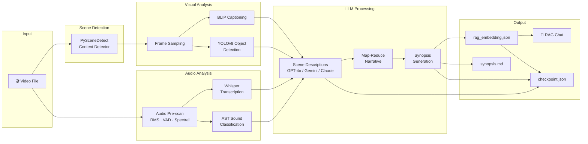
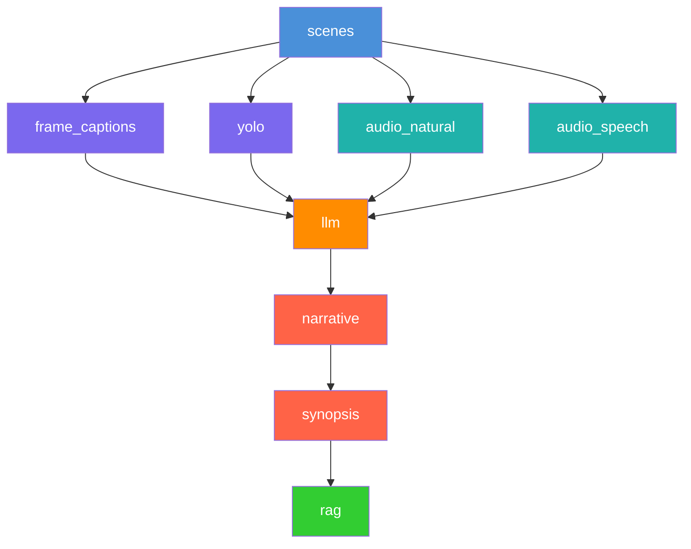

<div align="center">

# 🎬 Kairos

**Structured Video Understanding Through Multimodal AI**

Kairos analyses long-form videos by fusing visual perception and audio intelligence into rich, structured scene-level narratives — then makes every insight searchable through retrieval-augmented generation.

[](https://www.python.org/downloads/)
[](#license)
[](#llm-backends)

</div>

---

## ✨ What It Does

Given any video file, Kairos automatically:

1. **Detects scenes** — splits the video into semantically coherent segments
2. **Understands visuals** — captions frames (BLIP) and detects objects (YOLOv8)
3. **Understands audio** — transcribes speech (Whisper) and classifies sounds (AST)
4. **Generates descriptions** — an LLM synthesises each scene into a rich paragraph
5. **Builds a narrative** — map-reduce summarisation produces a full synopsis with Q&A
6. **Enables RAG** — chat with your video using natural language queries

---

## 🏗️ Pipeline Architecture



---

## 📦 Installation

### Prerequisites

- [Conda](https://docs.conda.io/en/latest/miniconda.html) (Miniconda or Anaconda)
- NVIDIA GPU with CUDA 12.4+ (recommended)
- API keys for at least one LLM backend (Gemini, OpenAI, or Anthropic)

### Setup

```bash
# 1. Clone the repository
git clone git@github.com:The-Kairos/Kairos_model.git
cd Kairos_model

# 2. Create the conda environment (Python 3.10, PyTorch + CUDA, ffmpeg)
conda env create -f environment.yml

# 3. Activate and verify
conda activate kairos
kairos --help
```

### Environment Variables

Create a `.env` file in the project root:

```dotenv
# At least one LLM backend key is required
GEMINI_API_KEY=your-gemini-key
OPENAI_API_KEY=your-openai-key
ANTHROPIC_API_KEY=your-anthropic-key

# Optional: default LLM backend (gemini | openai | claude)
LLM_BACKEND=gemini
```

---

## 🚀 Quick Start

```bash
# Process a video with the default pipeline
kairos process --video "path/to/video.mp4"

# Process with a specific LLM backend and preset
kairos process --video "path/to/video.mp4" --llm openai --preset fast

# Chat with a processed video via RAG
kairos rag --video "path/to/video.mp4"
```

---

## 🖥️ CLI Reference

### Entry Points

| Command | Entry Point | Description |
|---------|-------------|-------------|
| `kairos` | `kairos.cli.app:main` | Main pipeline — process videos or run RAG |
| `kairos-download` | `kairos.cli.download:main` | Download test videos from the catalog |
| `kairos-report` | `kairos.cli.report:main` | Generate markdown reports from pipeline logs |
| `kairos-compare` | `kairos.cli.compare:main` | Compare LLM descriptions against Excel ground truth |

### `kairos process` Options

| Flag | Description |
|------|-------------|
| `--video <path>` | Video file path or blob name (repeatable) |
| `--all` | Process all videos in the catalog |
| `--filter <tier>` | Filter catalog by length: `short`, `medium`, `long`, `extra` |
| `--include-unknown` | Include videos with unknown length when filtering |
| `--preset <name>` | Configuration preset (see [below](#-configuration-presets)) |
| `--llm <backend>` | LLM backend: `gemini`, `openai`, `claude` |
| `--redo <step>` | Re-run a step and all dependents (repeatable) |
| `--redo-only <step>` | Re-run only the specified step (non-transitive) |

### `kairos rag` Options

| Flag | Description |
|------|-------------|
| `--video <path>` | Video file path or blob name (**required**) |
| `--llm <backend>` | LLM backend: `gemini`, `openai`, `claude` |

---

## ⚙️ Configuration Presets

Presets override subsets of the default `PipelineConfig` dataclass. Select via `--preset`.

| Preset | Scene Threshold | Frames/Scene | YOLO FPS | LLM Workers | Best For |
|--------|:-:|:-:|:-:|:-:|---|
| **`default`** | 27.0 | 3 | 4.0 | 4 | General-purpose videos |
| **`fast`** | 40.0 | 1 | 4.0 | 8 | Quick previews, large batches |
| **`motion`** | 15.0 | 5 | 8.0 | 4 | Action, sports, fast cuts |
| **`static`** | 3.0 | 1 | 0.5 | 4 | Lectures, surveillance, slow content |

---

## 🔄 Redo System

Re-run any pipeline step without starting from scratch. The `--redo` flag is **transitive** — it automatically re-runs all downstream dependents. Use `--redo-only` for **non-transitive** re-execution of a single step.

```bash
# Re-run LLM descriptions + all downstream (narrative → synopsis → rag)
kairos process --video "video.mp4" --redo llm

# Re-run only YOLO detection (no downstream)
kairos process --video "video.mp4" --redo-only yolo
```

### Dependency Graph



### Pipeline Steps

| Step | Description | Depends On |
|------|-------------|------------|
| `scenes` | PySceneDetect scene splitting | — |
| `frame_captions` | Frame sampling + BLIP captioning | `scenes` |
| `yolo` | YOLOv8 object detection | `scenes` |
| `audio_natural` | AST sound classification | `scenes` |
| `audio_speech` | Whisper speech transcription | `scenes` |
| `llm` | LLM scene descriptions | `frame_captions`, `yolo`, `audio_natural`, `audio_speech` |
| `narrative` | Map-reduce narrative summary | `llm` |
| `synopsis` | Synopsis with timeline & Q&A | `narrative` |
| `rag` | Embedding generation for retrieval | `synopsis` |

---

## 💬 RAG — Chat With Your Video

After processing a video, Kairos generates embeddings (`rag_embedding.json`) that power a conversational interface over the video's content.

```bash
# Start an interactive RAG session
kairos rag --video "path/to/video.mp4"

# Use a specific LLM for answer generation
kairos rag --video "path/to/video.mp4" --llm openai
```

The RAG system retrieves the top-k most relevant scene contexts (default: 10) and feeds them to the LLM to generate grounded, accurate answers about anything in the video.

---

## 🧠 LLM Backends

Kairos supports three LLM backends, configurable via `--llm` flag or `LLM_BACKEND` environment variable:

| Backend | Flag | Env Key | Models |
|---------|------|---------|--------|
| Google Gemini | `--llm gemini` | `GEMINI_API_KEY` | Gemini Pro / Flash |
| OpenAI | `--llm openai` | `OPENAI_API_KEY` | GPT-4o |
| Anthropic Claude | `--llm claude` | `ANTHROPIC_API_KEY` | Claude 3.5 Sonnet |

---

## 📂 Project Structure

```
Kairos_model/
├── environment.yml              # Conda environment (Python, PyTorch, CUDA)
├── pyproject.toml               # Package metadata, dependencies, CLI entry points
├── docs/                        # Documentation
│   └── monitoring.md
│
├── src/kairos/                  # Main package
│   ├── __init__.py              # Package root
│   ├── __main__.py              # python -m kairos entry point
│   ├── config.py                # PipelineConfig dataclass with presets
│   ├── main.py                  # Legacy entry point
│   │
│   ├── audio/                   # Audio processing
│   │   ├── classifier.py        #   AST sound classification
│   │   ├── extraction.py        #   Audio stream extraction
│   │   ├── language.py          #   Language detection
│   │   ├── prescan.py           #   Audio pre-scan orchestration
│   │   ├── rms.py               #   RMS energy analysis
│   │   ├── spectral.py          #   Spectral feature analysis
│   │   ├── text_filter.py       #   Transcript filtering
│   │   ├── transcription.py     #   Whisper transcription
│   │   ├── vad.py               #   Voice activity detection
│   │   └── whisper_api.py       #   Whisper API client
│   │
│   ├── cli/                     # Command-line interface
│   │   ├── app.py               #   Main CLI application
│   │   ├── args.py              #   Argument parsing
│   │   ├── catalog.py           #   Video catalog management
│   │   ├── compare.py           #   LLM comparison tool
│   │   ├── download.py          #   Video downloader
│   │   ├── rag_session.py       #   Interactive RAG session
│   │   └── report.py            #   Markdown report generator
│   │
│   ├── core/                    # Pipeline infrastructure
│   │   ├── checkpoint.py        #   Checkpoint save/load
│   │   ├── exceptions.py        #   Custom exceptions
│   │   ├── logging.py           #   Structured logging
│   │   ├── models.py            #   Data models
│   │   ├── pipeline.py          #   Pipeline orchestration
│   │   ├── redo.py              #   Redo system (dependencies, clearing)
│   │   ├── scene.py             #   Scene data structures
│   │   ├── timing.py            #   Step timing & resource tracking
│   │   └── utils.py             #   Shared utilities
│   │
│   ├── llm/                     # LLM integration
│   │   ├── client.py            #   Multi-backend LLM client
│   │   ├── rag.py               #   RAG embedding & retrieval
│   │   ├── scene_description.py #   Scene description generation
│   │   └── synopsis/            #   Synopsis generation
│   │       ├── mapreduce.py     #     Map-reduce summarisation
│   │       ├── parsing.py       #     Output parsing
│   │       ├── prompts.py       #     Prompt construction
│   │       ├── render.py        #     Markdown rendering
│   │       └── synthesis.py     #     Synopsis orchestration
│   │
│   ├── prompts/                 # Prompt templates
│   │   ├── describe_scene.txt   #   Full scene description prompt
│   │   ├── chunk_summary.txt    #   Narrative chunk summary
│   │   ├── synopsis_*.txt       #   Synopsis generation prompts
│   │   ├── generate_answer.txt  #   RAG answer generation
│   │   └── gpt_normalizations.json
│   │
│   └── video/                   # Video processing
│       ├── scene_detection.py   #   PySceneDetect wrapper
│       ├── frame_sampling.py    #   Intelligent frame extraction
│       ├── frame_captioning.py  #   BLIP-2 captioning
│       ├── object_detection.py  #   YOLO orchestration
│       ├── yolo_inference.py    #   YOLOv8 inference
│       ├── tracking.py          #   Object tracking
│       ├── track_summary.py     #   Track summarisation
│       ├── spatial.py           #   Spatial analysis
│       └── debug_draw.py        #   Debug visualisation
│
└── tests/                       # Test suite (pytest)
```

### Output Per Video

Each processed video produces three output files:

| File | Description |
|------|-------------|
| `checkpoint.json` | Complete scene-level data (captions, detections, transcripts, descriptions) |
| `synopsis.md` | Human-readable narrative summary with timeline and Q&A |
| `rag_embedding.json` | Vector embeddings for retrieval-augmented generation |

---

## 📚 Documentation

| Page | Description |
|------|-------------|
| [Architecture](docs/architecture.md) | System design and component interactions |
| [Pipeline](docs/pipeline.md) | Detailed pipeline stage documentation |
| [Configuration](docs/configuration.md) | All config parameters and presets |
| [CLI](docs/cli.md) | Complete CLI usage guide |
| [RAG](docs/rag.md) | RAG system architecture and usage |
| [API Reference](docs/api-reference.md) | Python API documentation |
| [Models](docs/models.md) | ML model details (BLIP, YOLO, Whisper, AST) |
| [Benchmarks](docs/benchmarks.md) | Performance benchmarks and comparisons |
| [Monitoring](docs/monitoring.md) | Resource monitoring and observability |

---

## 📄 License

This project is licensed under the MIT License. See [LICENSE](LICENSE) for details.

---

<div align="center">
<sub>Built with ❤️ by the <a href="https://github.com/The-Kairos">Kairos</a> team</sub>
</div>
