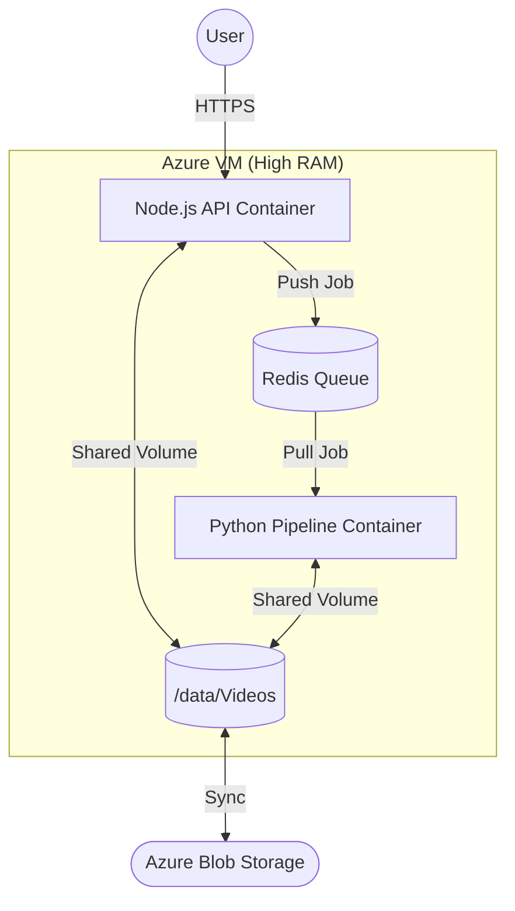

# Azure VM Deployment & Node.js Integration Guide
### Scaling Kairos Without Kubernetes

Since we are staying on an **Azure VM (High RAM)** and not using Kubernetes, we will use **Docker Compose** for orchestration. This keeps deployment simple, reproducible, and easy to manage.

---

## 1. System Architecture

The VM will run three primary containers:



- **Node.js Container**: Handles authentication, video uploads, and API requests.
- **Python Worker Container**: Runs the Kairos pipeline (Whisper, AST, YOLO, etc.).
- **Redis Container**: Acts as the message broker (using BullMQ for Node.js).
- **Shared Volume**: A local directory on the VM (e.g., `/mnt/data`) where both containers access video files.

---

## 2. The Integration Workflow (Node.js ↔ Python)

### Step 1: Upload & Store
1. User uploads a video.
2. Node.js backend saves it to the shared volume `/data/Videos/original.mp4`.
3. Node.js periodically syncs this folder to **Azure Blob Storage** for backup.

### Step 2: Queue the Job
Node.js uses `BullMQ` to push a JSON job to Redis:
```json
{
  "jobId": "video_123",
  "videoPath": "/data/Videos/original.mp4",
  "priority": "high"
}
```

### Step 3: Python Execution
A small **bridge script** (e.g., `worker_bridge.py`) in the Python container listens to the Redis queue. When a job arrives:
1. It calls `python -m audio_singlecall.main --video /data/Videos/original.mp4 ...`.
2. As stages finish, it updates the job status in Redis so the frontend can show a progress bar.

### Step 4: Collect Results
1. The pipeline saves `audio_results.json` to the video's output folder.
2. The Python worker notifies Node.js via Redis that the job is "Complete".
3. Node.js reads the JSON and returns it to the user.

---

## 3. Why This Works on Azure (No Kubernetes Needed)

### Using Docker Compose
Instead of complex YAML, we use a simple `docker-compose.yml`:
```yaml
services:
  api:
    build: ./backend
    volumes:
      - /mnt/data:/app/data
  worker:
    build: ./kairos-model
    volumes:
      - /mnt/data:/app/data
    deploy:
      resources:
        limits:
          memory: 128gb # Cap it if you want, or leave open on a 188gb VM
  redis:
    image: redis:alpine
```

### High RAM Strategy
On the Azure VM, we can process **multiple videos at once** by spinning up multiple worker containers or increasing `--workers` within the Python pipeline. Since we have ~180 GB available, we could safely run **4–6 long videos simultaneously** without hitting OOM.

---

## 4. Fault Tolerance: Checkpointing & Managed Disks

Long-running videos (like `Titanic` at 3+ hours) are vulnerable to VM restarts. Kairos handles this with **Granular Checkpointing**:

1. **State Persistence**: The pipeline saves `audio_checkpoint.json` in the results folder after each major stage (Scene Detection, Whisper, AST).
2. **Azure Managed Disks**: Always use a **Persistent Managed Disk** for your shared volumes. If the VM is deallocated, the disk survives. When the VM restarts, the Docker containers will find the `audio_checkpoint.json` and resume processing immediately.
3. **Docker Restart Policy**: Set `restart: always` or `restart: unless-stopped` in your `docker-compose.yml` so the pipeline resumes automatically on boot.

---

## 5. Security & Cleanup

1. **Firewall**: Only open port `443` (Node.js API). Redis and the Python worker stay hidden inside the Docker internal network.
2. **Auto-Cleanup**: After the final results are uploaded to Azure Blob, a `finally` block in the Python code deletes the local `.clips` and `.frames` folders to save disk space.
3. **Azure Blob Sync**: Use `azcopy` or the Azure SDK to move results to permanent storage, keeping the VM's disk lean.

---

## 5. Summary for the Team
- **Low Complexity**: No Kubernetes clusters to manage. Standard Docker knowledge is enough.
- **High Performance**: Direct disk access between Node.js and Python (via shared volumes) is faster than network transfers.
- **Scalable**: If one VM isn't enough, we just spin up a second VM with the same Docker image.
