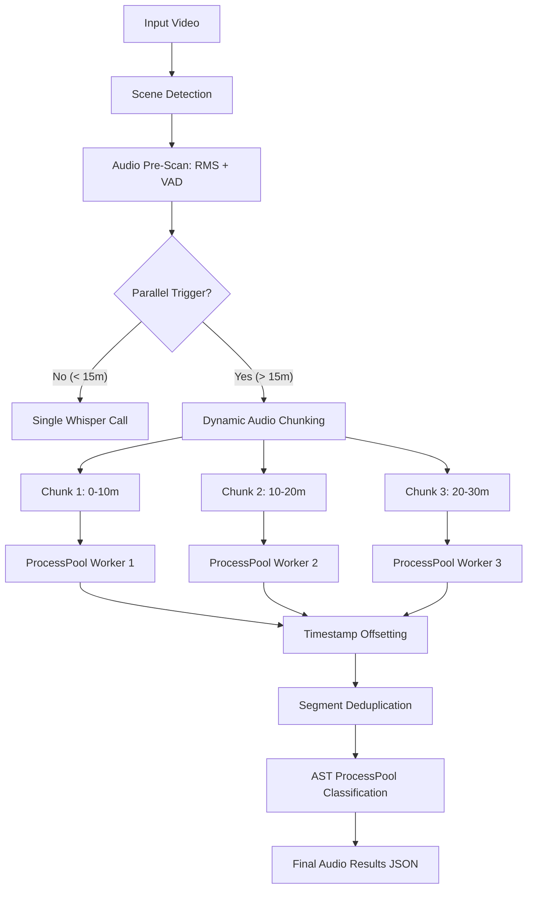

# High-Parallelism Audio Pipeline: Architecture & Flow

This document explains how the Kairos Audio Pipeline achieves sub-realtime performance on long videos using CPU-only parallelization.

---

## 1. The Core Problem
Transcribing a 3-hour video (like Titanic) involves loading a 1GB+ audio buffer into RAM. Standard Whisper processing is sequential, meaning a single CPU core handles the entire file, which is slow and memory-intensive (often leading to OOM errors).

## 2. The Solution: High Parallelism Mode
When `--parallel` is enabled (or video > 15m), the pipeline switches from a "Single-Call" approach to a "Dynamic Chunking" approach.

### Workflow Diagram

### Components of Parallelization

#### A. Dynamic Audio Chunking (`whisper_singlecall.py`)
- **Logic**: Clips the audio into **10-minute segments** with a **30-second overlap**.
- **Execution**: Uses `ProcessPoolExecutor` to bypass Python's Global Interpreter Lock (GIL). 
- **Efficiency**: Each core transcribes its own 10-minute chunk. A 30-minute video can be processed in roughly the time it takes for 10 minutes.

#### B. Multi-Process AST Classification (`ast_processor.py`)
- **Logic**: Instead of processing scenes one by one or using threads, it uses a **Process Pool**.
- **Reason**: AST (Audio Spectrogram Transformer) is a heavy neural network. Running it in processes allows the OS to schedule compute across all available CPU cores simultaneously.

#### C. Intelligent Deduplication
- **Problem**: Overlapping chunks may result in duplicate transcription or cut words.
- **Fix**: The pipeline sorts all segments by time and checks for near-identical matches (time + text) in the overlap regions, keeping the most complete version.

---

## 3. Memory Management
- **RAM Guard**: The pipeline only copies smaller chunks for processing instead of holding the entire 3-hour decoded audio in multiple processes at once.
- **Soft-VAD**: Whisper still uses Silero VAD internally to ignore silence within chunks, further speeding up inference.

## 4. Performance Expectations
- **Single-Call**: ~1:1 real-time (1 hour video takes 1 hour).
- **High-Parallel (6 cores)**: ~1:5 real-time (1 hour video takes ~12-15 minutes).
