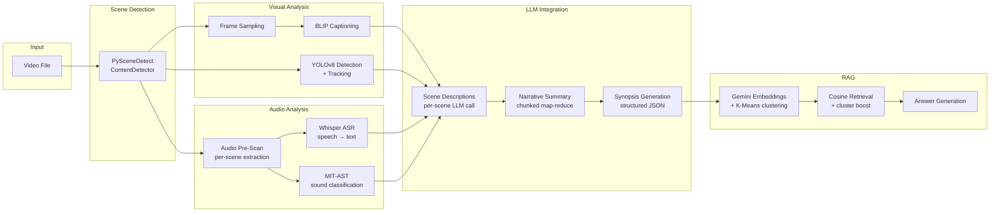
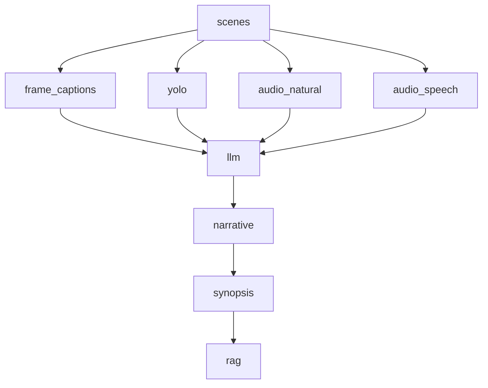
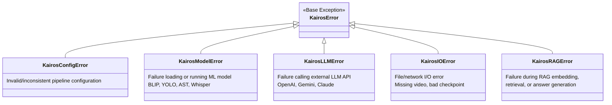

# Kairos — Architecture Document

> **Version:** 1.0  
> **Last updated:** 2025-07-15  
> **Repository:** [The-Kairos/Kairos_model](https://github.com/The-Kairos/Kairos_model)

---

## 1. System Overview

**Kairos** is an automated video-understanding platform that combines computer vision, audio analysis, and large language models to produce rich, structured descriptions of video content. Given a raw video file, Kairos:

1. **Detects scene boundaries** using PySceneDetect.
2. **Analyses visual content** — samples representative frames, generates natural-language captions (BLIP), and runs object detection with tracking (YOLOv8).
3. **Analyses audio content** — transcribes speech (Whisper ASR) and classifies environmental sounds (MIT-AST).
4. **Synthesises understanding** — feeds all modalities into an LLM to produce per-scene descriptions, a multi-chunk narrative, and a structured synopsis.
5. **Enables question-answering** — embeds the entire analysis into a vector store for retrieval-augmented generation (RAG).

The pipeline is **checkpoint-driven**: every stage persists its output to a JSON file so that processing can be resumed, and individual stages can be selectively re-executed via the **redo system**.

---

## 2. High-Level Architecture



---

## 3. Module Hierarchy

```mermaid
graph TD
    kairos[kairos]

    kairos --> audio[kairos.audio]
    kairos --> cli[kairos.cli]
    kairos --> core[kairos.core]
    kairos --> llm[kairos.llm]
    kairos --> video[kairos.video]

    audio --> a1[classifier]
    audio --> a2[extraction]
    audio --> a3[language]
    audio --> a4[prescan]
    audio --> a5[rms]
    audio --> a6[spectral]
    audio --> a7[text_filter]
    audio --> a8[transcription]
    audio --> a9[vad]
    audio --> a10[whisper_api]

    cli --> c1[app]
    cli --> c2[args]
    cli --> c3[catalog]
    cli --> c4[compare]
    cli --> c5[download]
    cli --> c6[rag_session]
    cli --> c7[report]

    core --> co1[checkpoint]
    core --> co2[exceptions]
    core --> co3[logging]
    core --> co4[models]
    core --> co5[pipeline]
    core --> co6[redo]
    core --> co7[scene]
    core --> co8[timing]
    core --> co9[utils]

    llm --> l1[client]
    llm --> l2[rag]
    llm --> l3[scene_description]
    llm --> l4[synopsis/]
    l4 --> l4a[mapreduce]
    l4 --> l4b[parsing]
    l4 --> l4c[prompts]
    l4 --> l4d[render]
    l4 --> l4e[synthesis]

    video --> v1[debug_draw]
    video --> v2[frame_captioning]
    video --> v3[frame_sampling]
    video --> v4[object_detection]
    video --> v5[scene_detection]
    video --> v6[spatial]
    video --> v7[track_summary]
    video --> v8[tracking]
    video --> v9[yolo_inference]
```



### Package Responsibilities

| Package | Purpose |
|---|---|
| `kairos.audio` | Audio extraction, speech transcription (Whisper), environmental sound classification (MIT-AST), voice activity detection, RMS energy, spectral analysis, language detection, and text filtering. |
| `kairos.cli` | Typer-based command-line interface — argument parsing, catalog management, video download, report generation, interactive RAG Q&A sessions, and pipeline comparison. |
| `kairos.core` | Pipeline orchestration, checkpoint persistence, redo/dependency logic, model registry, exception hierarchy, timing utilities, and shared helpers. |
| `kairos.llm` | LLM client abstraction (Gemini/OpenAI/Claude), per-scene description generation, synopsis map-reduce pipeline, and RAG embedding/retrieval/answer generation. |
| `kairos.video` | Scene detection (PySceneDetect), frame sampling, BLIP captioning, YOLO inference, object tracking, spatial analysis, track summarisation, and debug visualisation. |

---

## 4. Data Flow

The pipeline transforms data through a sequence of well-defined stages. Each stage reads from and writes to the **checkpoint dictionary**.

```
Raw Video (.mp4/.mkv)
  │
  ▼
┌─────────────────────────────────────────────────────┐
│ Scene Detection (PySceneDetect ContentDetector)     │
│ Output: list[dict] with start/end timecodes,        │
│         start_seconds, end_seconds, clip_path        │
└──────────────────────┬──────────────────────────────┘
                       │
          ┌────────────┼────────────┐
          ▼            ▼            ▼
   Frame Sampling   YOLO FPS    Audio Pre-Scan
   (N frames/scene) Sampling    (per-scene waveforms
    → numpy arrays  → numpy      at target sample rate)
          │         arrays              │
          ▼            │         ┌──────┴──────┐
   BLIP Captioning     ▼        ▼             ▼
   → list[str]      YOLOv8    Whisper       MIT-AST
   (captions per    Detection  ASR           Sound
    scene)          + Tracking → speech text  Classification
                    → dict with              → sound labels
                      labels, bboxes,          per scene
                      confidence, tracks
          │            │         │             │
          └────────────┴─────────┴─────────────┘
                       │
                       ▼
          ┌─────────────────────────────────┐
          │ LLM Scene Descriptions          │
          │ Input: captions + YOLO +        │
          │        speech + sounds +         │
          │        N previous scene context  │
          │ Output: llm_scene_description   │
          │         (string per scene)       │
          └───────────────┬─────────────────┘
                          │
                          ▼
          ┌─────────────────────────────────┐
          │ Narrative Summary (Map-Reduce)  │
          │ Scenes chunked by llm_chunk_len │
          │ Each chunk → LLM summary        │
          │ Output: narratives[]            │
          └───────────────┬─────────────────┘
                          │
                          ▼
          ┌─────────────────────────────────┐
          │ Synopsis Generation             │
          │ Narrative → structured JSON     │
          │ (summary, highlights, timeline, │
          │  suggested clips, Q&A pairs)    │
          └───────────────┬─────────────────┘
                          │
                          ▼
          ┌─────────────────────────────────┐
          │ RAG Embedding                   │
          │ Contexts: scene texts +         │
          │           synopsis fields        │
          │ → Gemini embedding vectors      │
          │ → K-Means clustering            │
          │ → rag_embedding.json            │
          └─────────────────────────────────┘
```

### Checkpoint Keys per Stage

| Stage | Per-Scene Keys | Top-Level Keys |
|---|---|---|
| Scene Detection | `start_timecode`, `end_timecode`, `start_seconds`, `end_seconds`, `clip_path`, `scene_index` | `scenes` |
| Frame Sampling + BLIP | `frame_captions` | — |
| YOLO | `yolo_detections` | — |
| Audio (Whisper) | `audio_speech` | — |
| Audio (AST) | `audio_natural` | — |
| LLM Descriptions | `llm_scene_description` | — |
| Narrative | — | `narratives` |
| Synopsis | — | `synopsis` |
| RAG | — | `rag_embedding` |

---

## 5. Checkpoint System

The checkpoint is a **single JSON file** (`checkpoint.json`) that lives in the per-video output directory (e.g. `data/processed/VideoName/checkpoint.json`). It provides:

### Resumability
- Before executing each stage, the pipeline checks whether the required output keys already exist in the checkpoint (`have_key()` for per-scene keys, `in checkpoint` for top-level keys, or `os.path.exists()` for the RAG file).
- If keys are present, the stage is **skipped entirely**.
- If the pipeline crashes mid-stage, the checkpoint reflects the last *completed* stage, and re-running the pipeline picks up where it left off.

### Frame Stripping
Heavy data (raw numpy frames, YOLO tracks, motion bullets) is **stripped** before serialisation via `clear_frames()`. The omitted keys are:

```python
{
    "frames", "yolo_frames", "frame_paths", "yolo_frame_paths",
    "frame_indices", "frame_timestamps", "sample_fps",
    "motion_bullets", "yolo_tracks", "yolo_track_summaries",
}
```

This keeps checkpoint files small (typically < 10 MB even for feature-length films) while still containing all textual analysis results.

### Checkpoint Schema (simplified)

```json
{
    "scenes": [
        {
            "scene_index": 0,
            "start_timecode": "00:00:00.000",
            "end_timecode": "00:00:05.200",
            "start_seconds": 0.0,
            "end_seconds": 5.2,
            "clip_path": "data/processed/Video/.clips/scene_0000.mp4",
            "frame_captions": ["a video frame of a person walking..."],
            "yolo_detections": { ... },
            "audio_speech": "Hello, welcome to...",
            "audio_natural": "Speech, Music",
            "llm_scene_description": "The scene opens with..."
        }
    ],
    "narratives": [ { "narrative_len": 5000, "text": "..." } ],
    "synopsis": {
        "summary": "...",
        "video_highlights": [...],
        "video_timeline": [...],
        "suggested_clips": [...],
        "questions": [{ "question": "...", "answer": "..." }]
    },
    "rag_embedding": {
        "rag_path": "data/processed/Video/rag_embedding.json",
        "context_count": 42,
        "embedding_dim": 768,
        "model": "gemini-embedding-001"
    },
    "steps": {
        "get_scene_list": { "elapsed": 12.3, ... },
        "caption_frames": { "elapsed": 45.1, ... }
    }
}
```

---

## 6. Redo System

The redo system allows selective re-execution of pipeline stages without restarting from scratch. It operates on a **dependency DAG** — when a stage is re-done, all downstream dependents are cleared by default.

### Dependency DAG



### Pipeline Order

```
scenes → frame_captions → yolo → audio_natural → audio_speech → llm → narrative → synopsis → rag
```

### Redo Modes

| Flag | Behaviour |
|---|---|
| `--redo llm` | Clears `llm` + all downstream (`narrative`, `synopsis`, `rag`) |
| `--redo llm --redo-only` | Clears **only** `llm` — downstream stages keep their data |
| `--redo scenes` | Clears **everything** (all stages depend on `scenes`) |

### What Gets Cleared

For each affected stage, `apply_redo()` removes:
1. **Per-scene keys** (e.g. `llm_scene_description` from each scene dict)
2. **Top-level keys** (e.g. `narratives`, `synopsis`)
3. **Step-log entries** (timing data in `checkpoint["steps"]`)
4. **Files on disk** (e.g. `rag_embedding.json` for the `rag` stage)

---

## 7. Configuration

All tunable parameters are centralised in the `PipelineConfig` dataclass (`src/kairos/config.py`). Values are validated eagerly in `__post_init__`.

### Key Parameters

| Parameter | Default | Description |
|---|---|---|
| `pyscene_threshold` | `27.0` | ContentDetector sensitivity (lower = more cuts) |
| `pyscene_shortest` | `2.0` | Minimum scene length in seconds |
| `frames_per_scene` | `3` | Number of frames sampled per scene for BLIP |
| `frame_resolution` | `320` | Target resolution (longest side, pixels) |
| `blip_*` | various | BLIP generation params (beam search, sampling, penalties) |
| `yolo_model_path` | `models/yolov8s.pt` | Path to YOLOv8 weights |
| `yolo_action_fps` | `4.0` | FPS for YOLO frame sampling |
| `yolo_conf_thres` | `0.8` | YOLO confidence threshold |
| `asr_model_size` | `"medium"` | Whisper model size |
| `asr_use_vad` | `True` | Enable Voice Activity Detection pre-filtering |
| `llm_scene_history` | `5` | Number of previous scenes as LLM context |
| `llm_chunk_len` | `20000` | Max characters per narrative chunk |
| `llm_summary_len` | `50000` | Max characters for full summary |
| `llm_cooldown_sec` | `0.0` | Cooldown between LLM API calls |
| `rag_top_k_context` | `10` | Number of contexts retrieved for RAG Q&A |

### Presets

| Preset | Use Case | Key Overrides |
|---|---|---|
| `PipelineConfig.default()` | Balanced quality/speed | All defaults |
| `PipelineConfig.fast()` | Quick processing | `threshold=40`, `frames=1`, `chunk=500k`, `workers=8` |
| `PipelineConfig.motion_sensitive()` | Action/sports content | `threshold=15`, `shortest=0.5`, `frames=5`, `yolo_fps=8` |
| `PipelineConfig.static_video()` | Lectures/interviews | `threshold=3`, `frames=1`, `yolo_fps=0.5` |

### BLIP Parameters

All BLIP generation parameters are collected via the `blip_params` property and forwarded as `**kwargs` to `model.generate()`:

```python
cfg.blip_params  # → dict with prompt, max_length, min_length,
                 #   num_beams, do_sample, top_p, temperature,
                 #   length_penalty, no_repeat_ngram_size,
                 #   repetition_penalty
```

---

## 8. LLM Client Abstraction

The LLM layer uses a **Protocol-based design** (`typing.Protocol` with `runtime_checkable`) to support multiple backends interchangeably.

### Protocol

```python
@runtime_checkable
class LLMClient(Protocol):
    @property
    def model(self) -> str: ...

    def generate(
        self,
        prompt: str,
        *,
        system: str | None = None,
        max_tokens: int = 2048,
        temperature: float = 0.3,
    ) -> str: ...
```

### Implementations

| Class | Backend | SDK | Notes |
|---|---|---|---|
| `GeminiLLMClient` | Google Vertex AI | `google-genai` | System prompt prepended to content (no dedicated field) |
| `OpenAILLMClient` | OpenAI / Azure | `openai` | Reasoning models (version ≥ 5) use `max_completion_tokens` only |
| `ClaudeLLMClient` | Anthropic Vertex | `anthropic[vertex]` | Uses Claude's `system` parameter natively |

### Client Construction

```python
from kairos.llm.client import build_llm_client

client = build_llm_client("gemini")   # explicit backend
client = build_llm_client()           # reads LLM_BACKEND env var (default: "openai")
```

### Environment Variables

| Variable | Default | Used By |
|---|---|---|
| `LLM_BACKEND` | `"openai"` | Backend selection |
| `GEMINI_PROJECT` | `"prj-udst-prod-oussama-1"` | Gemini + Claude |
| `GEMINI_LOCATION` | `"us-central1"` | Gemini |
| `GEMINI_MODEL` | `"gemini-2.5-flash"` | Gemini |
| `CLAUDE_LOCATION` | `"us-east5"` | Claude |
| `CLAUDE_MODEL` | `"claude-sonnet-4-6"` | Claude |
| `OPENAI_ENDPOINT` | — | OpenAI base URL |
| `OPENAI_KEY` | — | OpenAI API key |
| `OPENAI_MODEL` | `"gpt-4o"` | OpenAI |
| `GEMINI_EMBEDDING_MODEL` | `"gemini-embedding-001"` | RAG embeddings |
| `GEMINI_RAG_MODEL` | `"gemini-2.5-pro"` | RAG answer generation |

---

## 9. Thread Safety

### ModelRegistry Singleton

The `ModelRegistry` class (`src/kairos/core/models.py`) manages all ML model lifecycle with thread-safe lazy loading:

```
┌─────────────────────────────────────────────────────┐
│                  ModelRegistry                       │
│                                                      │
│  Class-level:  _instance_lock (threading.Lock)       │
│                _instance: ModelRegistry | None        │
│                                                      │
│  Instance-level:                                     │
│    _meta_lock  → guards _locks dict creation         │
│    _locks      → {model_name: threading.Lock}        │
│    _cache      → {model_name: loaded_model}          │
│                                                      │
│  Access pattern:                                     │
│    ModelRegistry.get()  → double-checked locking      │
│    registry.blip()      → per-model lock              │
│    registry.release()   → per-model lock + cuda clear │
└─────────────────────────────────────────────────────┘
```

### Design Details

- **Double-checked locking** for the singleton: `get()` checks `_instance is None` without a lock first, then acquires `_instance_lock` and checks again.
- **Per-model locks**: Each model family (`blip`, `yolo`, `ast`, `whisper_<size>`, `silero_vad`) gets its own `threading.Lock`, allowing concurrent loading of *different* models while preventing duplicate loading of the *same* model.
- **Meta-lock**: A separate lock (`_meta_lock`) guards the creation of new per-model locks to avoid race conditions in `_lock_for()`.
- **Memory management**: `release(name)` acquires the model's lock, pops it from the cache, deletes the reference, and calls `torch.cuda.empty_cache()` when a GPU is available. `release_all()` iterates all cached model names.

### Supported Models

| Accessor | Model | Default Device |
|---|---|---|
| `registry.blip()` | `Salesforce/blip-image-captioning-base` | CUDA if available |
| `registry.yolo()` | `models/yolov8s.pt` | Auto (ultralytics) |
| `registry.ast()` | `MIT/ast-finetuned-audioset-10-10-0.4593` | CPU |
| `registry.whisper()` | OpenAI Whisper (configurable size) | Configurable |
| `registry.silero_vad()` | `snakers4/silero-vad` | CPU |

---

## 10. Error Handling

All custom exceptions inherit from `KairosError`, enabling a single catch-all clause:



### Usage Patterns

```python
# Catch all Kairos errors
try:
    run_pipeline(video_path, output_dir, cfg, client)
except KairosError as exc:
    logger.error("Pipeline failed: %s", exc)

# Catch specific categories
try:
    model, processor = registry.blip()
except KairosModelError:
    # BLIP failed to load — fall back or abort

# Raised automatically
PipelineConfig(pyscene_threshold=-1)  # → KairosConfigError
```

### Where Exceptions Are Raised

| Exception | Raised By |
|---|---|
| `KairosConfigError` | `PipelineConfig.__post_init__()` on invalid parameter values |
| `KairosModelError` | `ModelRegistry` loaders when imports fail or model loading crashes |
| `KairosLLMError` | LLM client wrappers on empty/failed API responses |
| `KairosIOError` | Checkpoint/file utilities on missing files or I/O failures |
| `KairosRAGError` | RAG module on embedding or retrieval failures |
