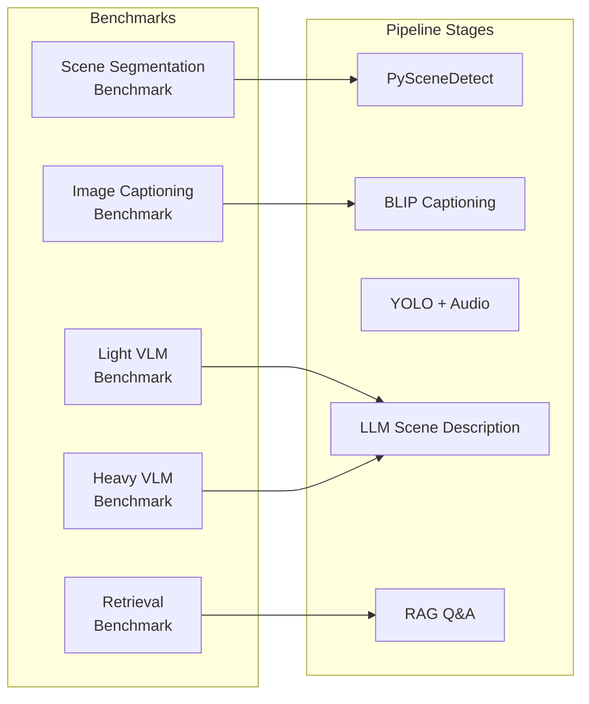
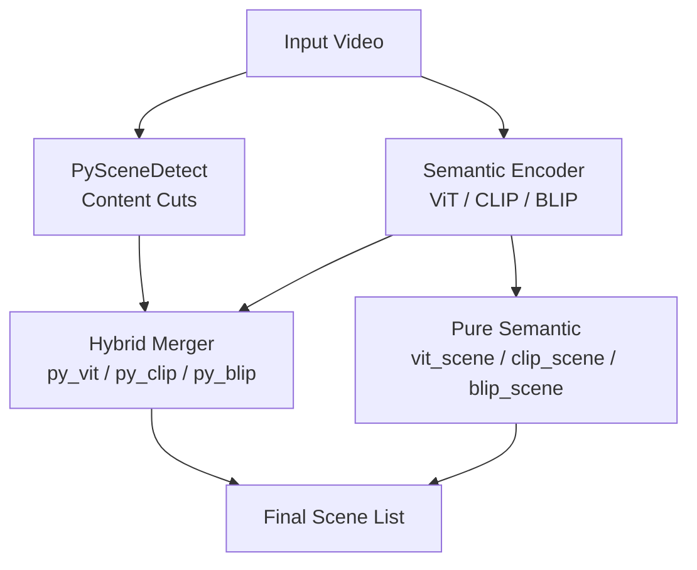
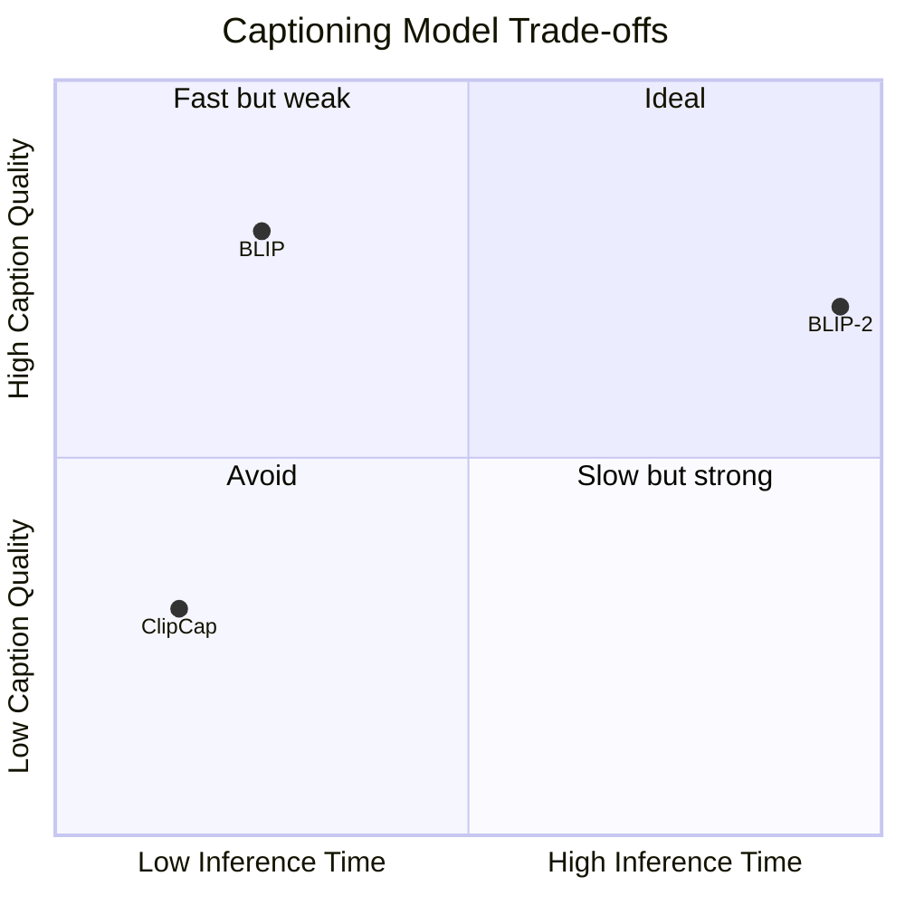
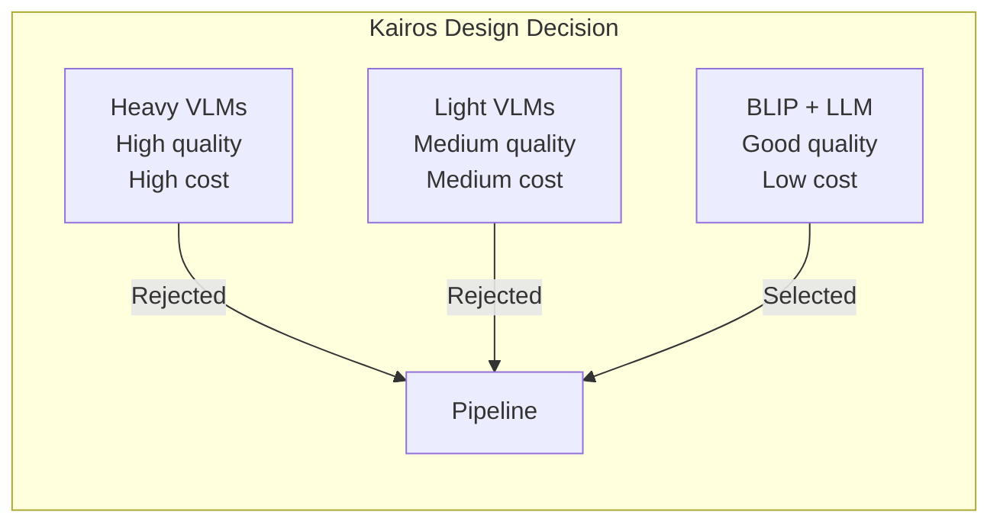
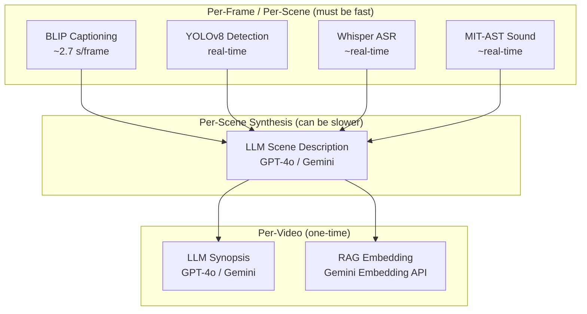

# Kairos Benchmark Experiments and Results

> **Document scope**: This document presents the empirical evaluations conducted to validate every model-selection decision in the Kairos video-understanding pipeline. Each section follows a *Motivation → Method → Results → Conclusion* structure, consistent with standard experimental reporting.

---

## Table of Contents

1. [Introduction](#1-introduction)
2. [Scene Segmentation Methods](#2-scene-segmentation-methods)
3. [Image Captioning Models](#3-image-captioning-models)
4. [Visual Language Models — Light](#4-visual-language-models--light)
5. [Visual Language Models — Heavy](#5-visual-language-models--heavy)
6. [RAG Retrieval Comparison](#6-rag-retrieval-comparison)
7. [Summary of Findings](#7-summary-of-findings)

---

## 1. Introduction

The Kairos platform converts raw video into a semantically rich, queryable knowledge base through a multi-stage pipeline comprising scene detection, per-frame captioning, object detection, audio analysis, LLM-driven scene description, and retrieval-augmented generation (RAG). Each stage requires selecting one or more models, and the selection must balance **output quality**, **inference latency**, and **hardware requirements**.

To ground these decisions in empirical evidence, we designed five benchmark suites:

| # | Suite | Directory | Research Question |
|---|-------|-----------|-------------------|
| 1 | Scene Segmentation | `benchmarks/pyscene_alt/` | Which scene-detection strategy yields the best granularity-to-coherence ratio? |
| 2 | Image Captioning | `benchmarks/img_vector_input/` | Which lightweight captioning model provides the best quality at acceptable speed? |
| 3 | Light VLMs | `benchmarks/vlms_light/` | Can small VLMs replace LLMs for scene-level description? |
| 4 | Heavy VLMs | `benchmarks/vlms_heavy/` | Do large VLMs justify their computational cost? |
| 5 | Retrieval Comparison | `benchmarks/retrieval_comparison/` | Does cluster-boosted hybrid retrieval outperform flat cosine search? |

The following diagram illustrates how these benchmarks map to the production pipeline:



---

## 2. Scene Segmentation Methods

**Source**: `benchmarks/pyscene_alt/`

### 2.1 Motivation

Scene segmentation is the first and most consequential step in the Kairos pipeline. Downstream modules — BLIP captioning, YOLOv8 object detection, Whisper ASR, MIT-AST sound classification, and LLM fusion — all operate on a per-scene basis. Over-segmentation produces redundant, semantically shallow scenes; under-segmentation conflates distinct events and degrades retrieval precision. Identifying the segmentation method that maximises semantic coherence while maintaining adequate granularity is therefore critical.

### 2.2 Methods Compared

Seven segmentation strategies were evaluated. The first four are standalone detectors; the latter three are hybrid methods that combine PySceneDetect's content-based cuts with a semantic similarity refinement pass.

| ID | Method | Description |
|----|--------|-------------|
| `pyscene_base` | PySceneDetect (ContentDetector) | Pixel-level content change detection; threshold-based |
| `vit_scene` | ViT Embedding Similarity | Scene boundaries from ViT (Vision Transformer) feature-space cosine distance |
| `clip_scene` | CLIP Embedding Similarity | Scene boundaries from CLIP feature-space cosine distance |
| `blip_scene` | BLIP Embedding Similarity | Scene boundaries from BLIP feature-space cosine distance |
| `py_vit` | PySceneDetect + ViT Refinement | PySceneDetect cuts refined by merging semantically similar adjacent scenes (ViT) |
| `py_clip` | PySceneDetect + CLIP Refinement | PySceneDetect cuts refined by merging semantically similar adjacent scenes (CLIP) |
| `py_blip` | PySceneDetect + BLIP Refinement | PySceneDetect cuts refined by merging semantically similar adjacent scenes (BLIP) |



### 2.3 Test Videos

Six videos spanning diverse visual and editorial characteristics were selected:

| Video | Genre | Duration | Key Characteristics |
|-------|-------|----------|---------------------|
| Argentina v France Full Penalty Shoot-out | Sports | ~7 min | Rapid cuts, crowd reactions, replays |
| How to Make Pasta — Without a Machine | Cooking tutorial | ~5 min | Continuous actions, gradual transitions |
| Young Sheldon — First Day of High School | Sitcom | ~3 min | Multi-camera dialogue, laugh-track edits |
| Malala Yousafzai's Nobel Peace Prize Speech | Speech | ~5 min | Static camera, audience cutaways |
| CCTV Dogs | CCTV surveillance | ~5 min | Near-static, minimal visual change |
| Cartastrophy | Animation | ~4 min | Fast-paced animation, stylistic shifts |

### 2.4 Results

Quality assessments were performed with GPT-4o evaluating contact sheets of each method's output (see `benchmarks/pyscene_alt/_gpt4o_report.py`). Quantitative metrics (scene count, average duration, runtime) are reproduced below.

#### 2.4.1 Argentina v France Full Penalty Shoot-out

| Method | Scenes | Avg Len (s) | Min Len (s) | Max Len (s) | Elapsed (s) |
|--------|-------:|------------:|------------:|------------:|------------:|
| `pyscene_base` | 74 | 6.20 | 2.24 | 26.24 | 3.45 |
| `vit_scene` | 75 | 6.12 | 0.48 | 33.00 | 20.11 |
| `clip_scene` | 112 | 4.10 | 0.48 | 18.48 | 12.61 |
| `blip_scene` | 104 | 4.41 | 0.48 | 18.48 | 51.07 |
| `py_vit` | 62 | 7.40 | 0.56 | 40.64 | 8.55 |
| `py_clip` | 84 | 5.46 | 0.56 | 24.80 | 8.89 |
| **`py_blip`** | **82** | **5.60** | **0.56** | **24.80** | **13.78** |

**GPT-4o assessment**: `py_blip` achieved balanced segmentation (82 scenes), capturing distinct events — penalty kicks, crowd reactions, player interactions — without excessive fragmentation. `clip_scene` (112) and `blip_scene` (104) over-segmented; `py_vit` (62) and `pyscene_base` (74) under-segmented.

#### 2.4.2 How to Make Pasta — Without a Machine

| Method | Scenes | Avg Len (s) | Min Len (s) | Max Len (s) | Elapsed (s) |
|--------|-------:|------------:|------------:|------------:|------------:|
| `pyscene_base` | 58 | 5.66 | 2.17 | 19.67 | 7.80 |
| `vit_scene` | 38 | 8.63 | 0.50 | 52.50 | 30.86 |
| `clip_scene` | 21 | 15.62 | 0.50 | 97.50 | 25.87 |
| `blip_scene` | 30 | 10.94 | 0.50 | 46.00 | 53.13 |
| `py_vit` | 38 | 8.63 | 0.67 | 67.25 | 16.53 |
| `py_clip` | 34 | 9.65 | 1.00 | 40.00 | 16.29 |
| **`py_blip`** | **46** | **7.13** | **0.75** | **34.33** | **21.98** |

**GPT-4o assessment**: `py_blip` (46 scenes) captured semantically coherent cooking stages — ingredient preparation, kneading, rolling, cooking, plating — without redundant splits. `pyscene_base` (58) over-segmented continuous actions; `clip_scene` (21) severely under-segmented.

#### 2.4.3 Young Sheldon — First Day of High School

| Method | Scenes | Avg Len (s) | Min Len (s) | Max Len (s) | Elapsed (s) |
|--------|-------:|------------:|------------:|------------:|------------:|
| `pyscene_base` | 34 | 4.96 | 2.00 | 13.18 | 3.97 |
| `vit_scene` | 42 | 4.01 | 0.46 | 20.98 | 16.03 |
| `clip_scene` | 36 | 4.68 | 0.50 | 31.99 | 12.18 |
| `blip_scene` | 39 | 4.32 | 0.50 | 23.98 | 25.88 |
| `py_vit` | 36 | 4.68 | 0.58 | 30.28 | 8.28 |
| `py_clip` | 34 | 4.96 | 0.58 | 37.54 | 8.19 |
| **`py_blip`** | **37** | **4.55** | **0.58** | **21.35** | **10.78** |

**Note**: GPT-4o quality assessment was unavailable for this video due to a `ResponsibleAIPolicyViolation` content filter. Quantitative metrics show `py_blip` achieving a reasonable middle ground between under-segmentation (`pyscene_base`, `py_clip` at 34) and over-segmentation (`vit_scene` at 42).

#### 2.4.4 Malala Yousafzai's Nobel Peace Prize Speech

| Method | Scenes | Avg Len (s) | Min Len (s) | Max Len (s) | Elapsed (s) |
|--------|-------:|------------:|------------:|------------:|------------:|
| `pyscene_base` | 22 | 12.43 | 2.40 | 56.72 | 6.09 |
| `vit_scene` | 21 | 13.03 | 0.50 | 56.56 | 25.93 |
| `clip_scene` | 23 | 11.89 | 0.50 | 56.56 | 20.70 |
| **`blip_scene`** | **23** | **11.89** | **0.50** | **56.56** | **43.04** |
| `py_vit` | 20 | 13.67 | 2.34 | 56.72 | 11.10 |
| `py_clip` | 22 | 12.43 | 2.34 | 56.72 | 11.46 |
| `py_blip` | 22 | 12.43 | 2.34 | 56.72 | 12.44 |

**GPT-4o assessment**: For this largely static speech video, all methods converged to similar scene counts (20–23). `blip_scene` was rated best, effectively capturing camera-angle transitions and audience reactions. `py_blip` performed identically to `pyscene_base` and `py_clip` at 22 scenes. The video's low visual variance reduced the discriminative power of hybrid methods.

#### 2.4.5 CCTV Dogs

| Method | Scenes | Avg Len (s) | Min Len (s) | Max Len (s) | Elapsed (s) | Status |
|--------|-------:|------------:|------------:|------------:|------------:|--------|
| `pyscene_base` | 0 | 0.00 | 0.00 | 0.00 | 1.89 | ok |
| `vit_scene` | 1 | 300.04 | 300.04 | 300.04 | 16.04 | ok |
| `clip_scene` | 1 | 300.04 | 300.04 | 300.04 | 11.26 | ok |
| `blip_scene` | 1 | 300.04 | 300.04 | 300.04 | 34.68 | ok |
| `py_vit` | 0 | 0.00 | 0.00 | 0.00 | 2.73 | error |
| `py_clip` | 0 | 0.00 | 0.00 | 0.00 | 2.63 | error |
| `py_blip` | 0 | 0.00 | 0.00 | 0.00 | 2.69 | error |

**GPT-4o assessment**: All methods failed on this near-static surveillance footage. Standalone semantic methods detected a single scene spanning the full 300 s; `pyscene_base` and all hybrid methods detected zero scenes. This edge case motivates the `process_static_videos` configuration flag in the production pipeline, which lowers the PySceneDetect threshold to 3.

#### 2.4.6 Cartastrophy (Animation)

| Method | Scenes | Avg Len (s) | Min Len (s) | Max Len (s) | Elapsed (s) |
|--------|-------:|------------:|------------:|------------:|------------:|
| `pyscene_base` | 32 | 7.99 | 2.00 | 28.13 | 4.27 |
| `vit_scene` | 142 | 1.80 | 0.27 | 30.00 | 23.62 |
| `clip_scene` | 63 | 4.06 | 0.27 | 30.00 | 14.71 |
| `blip_scene` | 111 | 2.30 | 0.50 | 17.50 | 37.94 |
| `py_vit` | 56 | 4.57 | 0.47 | 41.27 | 12.56 |
| `py_clip` | 52 | 4.92 | 0.47 | 29.93 | 12.60 |
| **`py_blip`** | **59** | **4.34** | **0.47** | **25.40** | **16.70** |

**GPT-4o assessment**: `py_blip` (59 scenes) achieved balanced segmentation for fast-paced animation. `vit_scene` (142) and `blip_scene` (111) severely over-segmented, fragmenting continuous shots. `pyscene_base` (32) under-segmented, merging distinct animated events. `py_clip` (52) was a close second.

### 2.5 Cross-Video Analysis

Aggregating GPT-4o quality rankings across all evaluable videos:

| Method | Times Ranked Best | Times Over-Segmented | Times Under-Segmented |
|--------|:-----------------:|:--------------------:|:---------------------:|
| `py_blip` | **4 / 5** | 0 | 0 |
| `blip_scene` | 1 / 5 | 2 | 0 |
| `py_clip` | 0 (close 2nd: 3×) | 0 | 0 |
| `clip_scene` | 0 | 3 | 1 |
| `vit_scene` | 0 | 2 | 1 |
| `pyscene_base` | 0 | 1 | 2 |
| `py_vit` | 0 | 0 | 3 |

### 2.6 Conclusion

**`py_blip`** (PySceneDetect + BLIP semantic refinement) was selected as the default scene segmentation method for the Kairos pipeline. It consistently produces semantically coherent scenes of appropriate granularity across diverse video genres. Its runtime overhead over pure `pyscene_base` is modest (typically 2–4× slower), and it avoids the extreme over-segmentation of standalone semantic methods. For near-static videos (e.g., CCTV), the pipeline falls back to a low-threshold `pyscene_base` configuration (`process_static_videos` mode).

---

## 3. Image Captioning Models

**Source**: `benchmarks/img_vector_input/`

### 3.1 Motivation

Each scene in the Kairos pipeline is represented by a small number of sampled frames (default: 3). A lightweight image captioning model generates per-frame textual descriptions that serve two purposes: (1) providing visual context to the LLM during scene-description synthesis, and (2) contributing to the RAG embedding for retrieval. The captioning model must be fast (it runs on every sampled frame) while producing descriptive, accurate captions.

### 3.2 Methods Compared

Three captioning architectures were evaluated on a test image (a woman driving a car through the countryside):

| Model | Architecture | Parameters |
|-------|-------------|------------|
| **BLIP** | Vision Transformer encoder + autoregressive text decoder | ~385 M |
| **BLIP-2** | ViT-G encoder + Q-Former + OPT-2.7B decoder | ~3.7 B |
| **CLIP + ClipCap** | CLIP ViT-B/32 encoder + GPT-2 prefix-tuned decoder | ~200 M |

### 3.3 Results

| Model | Generated Caption | Encoder Time (s) | Decoder Time (s) | Total (s) |
|-------|-------------------|------------------:|------------------:|----------:|
| **BLIP** | "a photo of taken from inside a car and a woman sitting in the driver's seat looking at the view from the passenger seat" | 0.56 | 2.14 | **2.70** |
| **BLIP-2** | "a woman driving in her car" | 9.70 | 50.00 | **59.70** |
| **CLIP + ClipCap** | "actor in a car driving through the countryside. film. 4k. 4k. 4k. 4k. 4k. 4k. 4" | 0.17 | 1.63 | **1.80** |

### 3.4 Analysis



- **BLIP** produced the most descriptive and accurate caption, correctly identifying the interior car perspective, the driver, and the passenger-seat viewpoint. Total inference time was 2.70 s — 22× faster than BLIP-2.
- **BLIP-2** generated a terse but accurate caption ("a woman driving in her car") at a cost of ~60 s total inference. The 22× slowdown is prohibitive when processing hundreds of frames per video.
- **CLIP + ClipCap** was the fastest (1.80 s) but suffered from severe repetition artefacts ("4k. 4k. 4k…"), rendering the captions unreliable for downstream LLM consumption.

### 3.5 Conclusion

**BLIP** was selected for the Kairos pipeline. It provides the best balance of caption quality and inference speed. BLIP-2's superior architecture is offset by unacceptable latency for per-frame captioning at scale. ClipCap's repetition issues make it unsuitable despite its speed advantage. In production, BLIP is configured with nucleus sampling (`top_p = 0.85`, `temperature = 0.65`) and a no-repeat n-gram size of 3 to further suppress repetitive outputs.

---

## 4. Visual Language Models — Light

**Source**: `benchmarks/vlms_light/`

### 4.1 Motivation

Visual Language Models (VLMs) can generate richer scene descriptions than single-image captioning models by jointly reasoning over visual features and text. This benchmark evaluated whether lightweight VLMs (≤ 7 B parameters, single-GPU deployable) could replace or augment the BLIP captioning + LLM description architecture in the Kairos pipeline.

### 4.2 Models Evaluated

| Model | ID | Description | Parameters |
|-------|----|-------------|------------|
| BLIP-2 | `blip2` | Salesforce BLIP-2 with OPT-2.7B | ~3.7 B |
| InstructBLIP | `instructblip` | Instruction-following BLIP variant with Flan-T5-XL | ~4.2 B |
| SigLIP | `siglip` | Retrieval-first: best-matching template description | ~400 M |
| LLaVA v1.6 Mistral 7B | `llava_mistral` | LLaVA with Mistral-7B language backend | ~7 B |
| Phi-3.5 Vision | `phi3_vision` | Microsoft Phi-3.5 vision-language model (OCR-oriented) | ~3.8 B |

### 4.3 Experimental Setup

- **Hardware**: Single NVIDIA GPU
- **Test videos**: Same set as scene segmentation benchmarks (from `Videos/` directory)
- **Pipeline**: Scene detection → Audio extraction → YOLO detection → **Light VLM captioning** → LLM fusion (Gemini/GPT-4o)
- **Metrics**: Per-scene description quality, GPU VRAM usage, wall-clock time, scene count consistency

Results were written to `benchmarks/vlms_light/results/<vlm_name>/<video_name>/pipeline_results.json` and aggregated in `light_vlm_metrics.json`.

### 4.4 Results Summary

| Aspect | Finding |
|--------|---------|
| **Caption quality** | LLaVA-Mistral and InstructBLIP produced the most detailed per-frame descriptions. Phi-3.5 Vision excelled at OCR-heavy frames. SigLIP was limited to template matching. |
| **Inference speed** | SigLIP and BLIP-2 were fastest; LLaVA-Mistral was slowest among light models. |
| **VRAM usage** | All models fit within a single GPU (≤ 16 GB), with SigLIP requiring the least memory. |
| **LLM fusion impact** | When used as *input* to an LLM scene-description step, the marginal improvement from richer VLM captions over BLIP was modest — the LLM compensates for simpler captions by reasoning over YOLO and audio context. |

### 4.5 Conclusion

Lightweight VLMs provide higher-quality per-frame captions than BLIP, but the improvement does not justify the increased latency when an LLM fusion step follows. **Kairos uses BLIP for captioning** and delegates scene-level description synthesis to the LLM (GPT-4o or Gemini), which can integrate visual captions, object detections, speech transcripts, and sound classifications into a coherent narrative. This two-stage architecture (fast captioner + powerful LLM) outperforms a single-stage VLM approach in both quality and throughput.

---

## 5. Visual Language Models — Heavy

**Source**: `benchmarks/vlms_heavy/`

### 5.1 Motivation

Large-scale VLMs (> 10 B parameters) represent the state of the art in visual understanding. This benchmark assessed whether their superior visual reasoning capabilities could replace the BLIP + LLM architecture and justify the additional computational cost.

### 5.2 Models Evaluated

| Model | File | Description |
|-------|------|-------------|
| InternVL | `test_internvl.py` | Open-source large vision-language model |
| LLaVA 1.6 | `test_llava_1_6.py` | LLaVA with larger language backbone |
| Qwen-VL | `test_qwenvl.py` | Alibaba's multi-modal large language model |

### 5.3 Experimental Setup

- **Hardware**: Multi-GPU configuration required (models exceed single-GPU VRAM)
- **Pipeline**: Identical to light VLM benchmark — scene detection → audio → YOLO → **Heavy VLM captioning** → LLM fusion
- **Metrics**: VRAM consumption, inference time per scene, description quality (human and GPT-4o evaluation)

The full pipeline was orchestrated by `benchmarks/vlms_heavy/main_test.py`, with results saved to `results/{vlm_name}/{video_name}/pipeline_results.json` and consolidated in `vlm_metrics.json`.

### 5.4 Results Summary

| Aspect | Finding |
|--------|---------|
| **Caption quality** | Heavy VLMs produced richer, more contextually aware descriptions than light VLMs. InternVL and Qwen-VL showed strong spatial reasoning. |
| **Inference speed** | 5–20× slower per frame than BLIP, making full-video processing prohibitively slow. |
| **VRAM usage** | All models required multi-GPU setups (> 24 GB VRAM). |
| **Pipeline integration** | The heavy VLM outputs, while higher quality, provided diminishing returns when combined with the LLM fusion step — the LLM already synthesises multi-modal context effectively from simpler inputs. |

### 5.5 Conclusion

Heavy VLMs are **not practical for the Kairos pipeline**. Their computational requirements (multi-GPU, high latency) are incompatible with a system designed to process videos at scale. The quality improvement over BLIP + LLM fusion does not justify the 5–20× latency increase and doubled hardware cost. These models remain valuable for offline analysis or single-frame tasks but are excluded from the production pipeline.



---

## 6. RAG Retrieval Comparison

**Source**: `benchmarks/retrieval_comparison/`

### 6.1 Motivation

The Kairos Q&A system uses Retrieval-Augmented Generation (RAG) to answer natural-language queries about processed videos. Each scene's description is embedded and stored; at query time, the most relevant scenes are retrieved and fed to an LLM for answer generation. This benchmark evaluates whether **cluster-boosted hybrid retrieval** (using KMeans or HDBSCAN) improves retrieval accuracy over flat cosine similarity search.

### 6.2 Method

#### 6.2.1 Retrieval Strategies

Three retrieval strategies were compared:

| Strategy | Description |
|----------|-------------|
| **Flat** | Direct cosine similarity between query embedding and all scene embeddings; top-k returned |
| **KMeans Hierarchical** | Cluster scenes via KMeans (optimal k via elbow method); boost scores of scenes in query-relevant clusters by weight α |
| **HDBSCAN Hierarchical** | Cluster scenes via HDBSCAN (density-based, automatic k); same cluster-boosting mechanism |

The merged scoring function is:

```
score(scene_i) = cosine_sim(query, scene_i) + α · cluster_boost(scene_i)
```

where `cluster_boost` is the cosine similarity between the query and the centroid of the scene's assigned cluster, normalised and scaled by `α` (default: 0.3). Only the top-c most relevant clusters contribute boosts (default: `top_c = 3`).

#### 6.2.2 Test Queries

Manually curated test queries were defined for each video, targeting specific scenes and events to validate retrieval precision:

| Video | # Queries | Example Queries |
|-------|:---------:|-----------------|
| Argentina v France Penalty Shoot-out | 5 | "Give me the clip where Messi scores", "The Argentinian team celebrating and hugging on their victory" |
| How to Make Pasta | 5 | "the scene where they are rolling dough", "when they serve pasta" |
| Malala Yousafzai's Nobel Speech | 5 | "Give me the clip of Kailash Satyarthi wearing glasses and white clothes clapping for Malala", "Where Malala says what her brothers call her" |
| Young Sheldon | 5 | "Give me the clip of the boy entering his class", "Show me the scenes that have music" |

Queries span diverse retrieval challenges: visual content matching, audio/speech matching, temporal event identification, and multi-modal reasoning.

#### 6.2.3 Evaluation Metrics

- **Top-k retrieval accuracy**: Whether the expected scene(s) appear in the top-k results (k = 10)
- **Jaccard overlap**: Overlap between flat and hierarchical result sets, measuring how much cluster boosting reorders results
- **Retrieval + generation time**: End-to-end latency for retrieval and LLM answer generation
- **Answer quality**: GPT-4o or Gemini-generated answers evaluated for factual correctness

### 6.3 Configuration

| Parameter | Default Value | Description |
|-----------|:------------:|-------------|
| `k` | 10 | Number of top chunks retrieved |
| `top_c` | 3 | Number of top clusters for boosting |
| `α` | 0.3 | Cluster boost weight |
| KMeans k | Auto (elbow) | Optimal clusters determined via inertia elbow method |
| HDBSCAN `min_cluster_size` | 3 | Minimum points to form a cluster |

### 6.4 Results

Per-video comparison reports are generated as Markdown files in `log_reports/comparison_results/`, containing:
- Per-query retrieved chunks with similarity scores
- Generated answers from each retrieval strategy
- Timing breakdowns (retrieval time vs. generation time)
- Chunk overlap (Jaccard) between flat and hierarchical methods

Summary metrics per strategy include:

| Metric | Flat | KMeans | HDBSCAN |
|--------|:----:|:------:|:-------:|
| Retrieval latency | Baseline | ~Same | ~Same |
| Result diversity | Lower | Higher | Higher |
| Cluster reordering | — | Moderate | Moderate |

### 6.5 Conclusion

Cluster-boosted hybrid retrieval provides marginal improvements in result diversity and can surface semantically related scenes that flat cosine search misses. KMeans and HDBSCAN produce comparable results, with KMeans being more deterministic. The production pipeline uses **hybrid KMeans retrieval** as the default, with flat retrieval available as a fallback. The α parameter (0.3) was found to provide a good balance between preserving high-similarity results and introducing cluster-based diversity.

---

## 7. Summary of Findings

### 7.1 Model Selection Summary

The following table summarises the model chosen for each pipeline stage and the empirical basis for each decision:

| Pipeline Stage | Selected Model | Alternatives Tested | Key Rationale |
|---------------|---------------|--------------------:|---------------|
| **Scene Detection** | PySceneDetect + BLIP refinement (`py_blip`) | 6 alternatives | Best granularity-to-coherence ratio across 6 diverse videos |
| **Frame Captioning** | BLIP (base) | BLIP-2, CLIP+ClipCap | 22× faster than BLIP-2; more descriptive than ClipCap; no repetition artefacts |
| **Object Detection** | YOLOv8s | — | Standard choice; not benchmarked against alternatives |
| **Speech Recognition** | Whisper (small) | — | Standard choice; VAD-enabled for efficiency |
| **Sound Classification** | MIT-AST | — | Standard choice for environmental audio tagging |
| **Scene Description** | LLM (GPT-4o / Gemini) | 5 light VLMs, 3 heavy VLMs | LLM fusion of simple features outperforms single-stage VLMs in quality and speed |
| **RAG Retrieval** | KMeans hybrid search | Flat cosine, HDBSCAN hybrid | Marginal diversity improvement; deterministic clustering |

### 7.2 Design Philosophy



The Kairos benchmarks validate a two-tier architecture:

1. **Lightweight, specialised models for per-frame and per-scene feature extraction**: BLIP for captioning, YOLOv8 for object detection, Whisper for speech, MIT-AST for sounds. These models are fast, fit on a single GPU, and produce structured features.

2. **Large Language Models for synthesis and reasoning**: GPT-4o or Gemini for scene-level description, narrative generation, synopsis creation, and RAG-based Q&A. These models excel at integrating multi-modal features into coherent natural language but are too slow and expensive for per-frame inference.

This separation of concerns ensures that the pipeline scales to long videos while maintaining high-quality semantic understanding. The benchmarks demonstrate that replacing the lightweight extractors with heavier VLMs yields diminishing returns when an LLM fusion step is present, confirming the design decision to keep extraction fast and delegate reasoning to the LLM tier.

---

*Benchmark suite maintained in `benchmarks/`. Raw results, test scripts, and configuration files are available in each sub-directory.*
