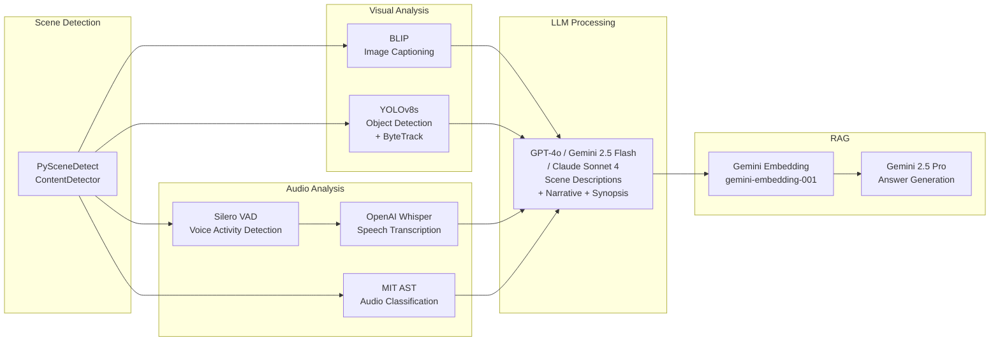

# ML Models in Kairos

This document covers every ML model used in the Kairos video-processing pipeline, including where each model is used, its configuration parameters, and how it is managed by the `ModelRegistry`.

---

## Pipeline Model Map



---

## ModelRegistry

All heavy ML models are managed by the `ModelRegistry` singleton (`kairos.core.models`), which provides:

- **Lazy loading** — models are loaded only on first access, not at import time.
- **Thread-safe caching** — each model family has its own `threading.Lock`, so independent models can load concurrently while the same model is loaded at most once.
- **Memory management** — `release(name)` frees a specific model; `release_all()` frees everything and clears the CUDA cache.

```python
from kairos.core.models import ModelRegistry

registry = ModelRegistry.get()          # process-wide singleton
model, processor = registry.blip()      # loads on first call, cached after
registry.release("blip")                # free memory when done
registry.release_all()                  # free everything
```

### Registry-Managed Models

| Registry Method | Model Key | Returns |
|----------------|-----------|---------|
| `registry.blip()` | `"blip"` | `(model, processor)` |
| `registry.yolo()` | `"yolo"` | YOLO model |
| `registry.ast()` | `"ast"` | `(feature_extractor, model)` |
| `registry.whisper()` | `"whisper_medium"` | Whisper model |
| `registry.silero_vad()` | `"silero_vad"` | `(model, get_speech_timestamps)` |

---

## BLIP — Image Captioning

| Property | Value |
|----------|-------|
| **Model** | `Salesforce/blip-image-captioning-base` |
| **Library** | HuggingFace Transformers (`BlipForConditionalGeneration`, `BlipProcessor`) |
| **Purpose** | Generate natural-language captions for sampled video frames |
| **Pipeline Stage** | Frame Captioning (`_run_frame_processing`) |
| **Device** | CUDA if available, else CPU |
| **Registry Key** | `"blip"` |

### Configuration Parameters (from `PipelineConfig`)

| Parameter | Default | Description |
|-----------|---------|-------------|
| `blip_start_prompt` | `"a video frame of"` | Starting text prompt for conditional generation |
| `blip_caption_len` | `50` | Maximum caption length in tokens |
| `blip_min_length` | `15` | Minimum caption length in tokens |
| `blip_num_beams` | `1` | Number of beams for beam search |
| `blip_do_sample` | `True` | Whether to use sampling during generation |
| `blip_top_p` | `0.85` | Nucleus sampling probability threshold |
| `blip_temperature` | `0.65` | Sampling temperature |
| `blip_length_penalty` | `1.0` | Length penalty for beam search |
| `blip_no_repeat_ngram_size` | `3` | N-gram size to prevent repetition |
| `blip_repetition_penalty` | `1.1` | Repetition penalty factor |

### Usage in Pipeline

1. Frames are sampled from each scene (controlled by `frames_per_scene` and `frame_resolution`).
2. Each frame is passed through BLIP with the configured generation parameters.
3. Captions are stored per scene in the checkpoint under `frame_captions`.

---

## YOLOv8s — Object Detection + Tracking

| Property | Value |
|----------|-------|
| **Model** | YOLOv8s (`models/yolov8s.pt`) |
| **Library** | Ultralytics |
| **Tracker** | ByteTrack (built-in to Ultralytics) |
| **Purpose** | Detect and track objects across video frames within each scene |
| **Pipeline Stage** | Object Detection (`_run_yolo`) |
| **Registry Key** | `"yolo"` |

### Configuration Parameters (from `PipelineConfig`)

| Parameter | Default | Description |
|-----------|---------|-------------|
| `yolo_model_path` | `"models/yolov8s.pt"` | Path to the YOLOv8 model weights |
| `yolo_action_fps` | `4.0` | Frames per second sampled for YOLO detection |
| `yolo_conf_thres` | `0.8` | Confidence threshold for detections |
| `yolo_iou_thres` | `0.5` | IoU threshold for non-maximum suppression |

### Usage in Pipeline

1. Frames are sampled at a fixed FPS (`yolo_action_fps`) per scene.
2. YOLOv8s runs detection with the configured confidence and IoU thresholds.
3. Detections (labels + confidence scores) are stored per scene in the checkpoint under `yolo_detections`.

---

## MIT AST — Audio Scene Classification

| Property | Value |
|----------|-------|
| **Model** | `MIT/ast-finetuned-audioset-10-10-0.4593` |
| **Library** | HuggingFace Transformers (`AutoModelForAudioClassification`, `AutoFeatureExtractor`) |
| **Purpose** | Classify environmental/background sounds in each scene's audio |
| **Pipeline Stage** | Audio Analysis (`_run_audio` → `extract_sounds_optimized`) |
| **Device** | CPU (default for AST) |
| **Registry Key** | `"ast"` |

### Configuration Parameters

| Parameter | Default | Description |
|-----------|---------|-------------|
| `ast_target_sr` | `16000` | Target sample rate for audio classification |
| Classification threshold | `0.3` | Minimum sigmoid probability for a label to be included |

### Usage in Pipeline

1. Audio is pre-scanned and segmented per scene.
2. Scenes with RMS below the silence threshold are skipped.
3. AST classifies each scene's audio, returning labels like `"speech (conf=0.85), music (conf=0.42)"`.
4. Results are stored per scene under `audio_natural`.
5. Execution uses `ProcessPoolExecutor` or `ThreadPoolExecutor` with up to 4 workers.

### AudioSet Labels

The model is fine-tuned on AudioSet and can detect 527 sound categories including speech, music, vehicle sounds, animal sounds, environmental sounds, and more.

---

## OpenAI Whisper — Speech Transcription

| Property | Value |
|----------|-------|
| **Model** | OpenAI Whisper (`medium` size by default) |
| **Library** | `openai-whisper` (local) / Azure OpenAI API (cloud) |
| **Purpose** | Transcribe spoken dialogue in video audio |
| **Pipeline Stage** | Audio Analysis (`_run_audio` → `extract_speech_singlecall`) |
| **Registry Key** | `"whisper_medium"` |

### Dual Backend

Kairos supports two Whisper backends:

| Backend | When Used | Details |
|---------|-----------|---------|
| **Azure OpenAI API** | Preferred when `WHISPER_API_KEY` and `WHISPER_API_ENDPOINT` are set | Cloud-based, uses the deployment specified by `WHISPER_API_DEPLOYMENT` |
| **Local Model** | Fallback when API credentials are missing or API call fails | Loads the `openai-whisper` model locally |

### Configuration Parameters

| Parameter | Default | Description |
|-----------|---------|-------------|
| `asr_model_size` | `"medium"` | Whisper model size (`tiny`, `base`, `small`, `medium`, `large`) |
| `asr_use_vad` | `True` | Whether to use Voice Activity Detection for audio cleaning |
| `asr_target_sr` | `16000` | Target sample rate for speech recognition |

### Transcription Modes

| Mode | Trigger | Description |
|------|---------|-------------|
| **Single-call** | Audio ≤ 15 minutes and `parallel=False` | Full audio transcribed in one Whisper call with VAD-guided noise reduction |
| **Parallel chunked** | Audio > 15 minutes or `parallel=True` | Audio split into 600s chunks with 30s overlap, transcribed in parallel (ThreadPool for API, ProcessPool for local) |

### Pipeline Flow

1. Audio pre-scan determines if speech is present.
2. Noise reduction is applied (broadband + optional VAD-guided).
3. Whisper transcribes the audio (API or local, single or parallel).
4. Segments are deduplicated and hallucinations are filtered.
5. Segments are mapped to scenes based on temporal overlap.
6. Results stored per scene under `audio_speech`.

---

## Silero VAD — Voice Activity Detection

| Property | Value |
|----------|-------|
| **Model** | Silero VAD (`snakers4/silero-vad`) |
| **Library** | PyTorch Hub |
| **Purpose** | Detect speech regions in audio for Whisper pre-processing |
| **Pipeline Stage** | Audio Analysis (used within Whisper transcription) |
| **Registry Key** | `"silero_vad"` |

### Configuration Parameters (thresholds dict)

| Parameter | Description |
|-----------|-------------|
| `VAD_THRESHOLD` | Speech probability threshold |
| `MIN_SPEECH_DURATION_MS` | Minimum speech duration in milliseconds |
| `MIN_SILENCE_DURATION_MS` | Minimum silence gap in milliseconds |
| `SPEECH_PAD_MS` | Padding added around each speech region in milliseconds |

### Usage in Pipeline

1. Loaded via `torch.hub.load("snakers4/silero-vad", ...)`.
2. Used in `clean_audio()` to identify speech regions for targeted noise reduction.
3. Used in `detect_speech_regions()` to get `(start_sec, end_sec)` boundaries.
4. The model + `get_speech_timestamps` function are cached as module-level singletons (and also available via `ModelRegistry`).

---

## Gemini Embedding — RAG Embeddings

| Property | Value |
|----------|-------|
| **Model** | `gemini-embedding-001` |
| **Library** | `google-genai` SDK (Vertex AI) |
| **Purpose** | Generate dense vector embeddings for RAG context retrieval |
| **Pipeline Stage** | RAG Embedding (`_run_rag` → `make_embedding`) |
| **Not in ModelRegistry** | Uses the Gemini API client directly |

### Configuration

| Parameter | Default | Description |
|-----------|---------|-------------|
| `GEMINI_EMBEDDING_MODEL` env var | `"gemini-embedding-001"` | Embedding model identifier |
| `MAX_EMBED_BATCH` | `250` | Maximum texts per API call |

### Usage in Pipeline

1. Scene and synopsis contexts are formatted into embeddable text strings.
2. Texts are embedded in batches of up to 250.
3. Embeddings are clustered with K-Means.
4. Everything is saved to `rag_embedding.json`.

---

## LLMs — Scene Descriptions, Narrative, Synopsis, RAG Answers

Kairos supports three LLM backends through a unified `LLMClient` protocol:

### Supported Models

| Backend | Client Class | Default Model | Env Vars |
|---------|-------------|---------------|----------|
| **OpenAI** | `OpenAILLMClient` | `gpt-4o` | `OPENAI_KEY`, `OPENAI_ENDPOINT`, `OPENAI_MODEL` |
| **Gemini** | `GeminiLLMClient` | `gemini-2.5-flash` | `GEMINI_PROJECT`, `GEMINI_LOCATION`, `GEMINI_MODEL` |
| **Claude** | `ClaudeLLMClient` | `claude-sonnet-4-6` | `CLAUDE_PROJECT`, `CLAUDE_LOCATION`, `CLAUDE_MODEL` |

### LLMClient Protocol

All backends implement the same interface:

```python
class LLMClient(Protocol):
    @property
    def model(self) -> str: ...

    def generate(
        self,
        prompt: str,
        *,
        system: str | None = None,
        max_tokens: int = 2048,
        temperature: float = 0.3,
    ) -> str: ...
```

### Usage in Pipeline

LLMs are used at four stages:

| Stage | Purpose | Configuration |
|-------|---------|---------------|
| **Scene Descriptions** | Generate natural-language descriptions from BLIP + YOLO + AST + Whisper | `llm_scene_history` (context window of N previous scenes), `llm_cooldown_sec` |
| **Narrative Summary** | Chunk scene descriptions and summarize into a narrative | `llm_chunk_len` (max chars per chunk), `llm_summary_len` (max summary length) |
| **Synopsis** | Synthesize a concise video synopsis from the narrative | Uses dedicated prompt templates |
| **RAG Answer Generation** | Generate answers from retrieved contexts | Default model: `gemini-2.5-pro` (via `GEMINI_RAG_MODEL`) |

### LLM Configuration Parameters (from `PipelineConfig`)

| Parameter | Default | Description |
|-----------|---------|-------------|
| `llm_scene_history` | `5` | Number of previous scenes included as context for each description |
| `llm_chunk_len` | `20000` | Maximum character length per narrative chunk |
| `llm_summary_len` | `50000` | Maximum character length for the full summary |
| `llm_cooldown_sec` | `0.0` | Cooldown in seconds between LLM API calls |
| `llm_max_workers` | `4` | Maximum parallel LLM workers |

### Backend Selection

The backend is selected via:
1. `--llm` CLI flag (highest priority)
2. `LLM_BACKEND` environment variable
3. Default: `"openai"`

---

## PySceneDetect — Scene Detection

| Property | Value |
|----------|-------|
| **Library** | `scenedetect` (PySceneDetect) |
| **Detector** | `ContentDetector` |
| **Purpose** | Detect scene boundaries in video based on content changes |
| **Pipeline Stage** | Scene Detection (`_run_scene_detection`) |
| **Not in ModelRegistry** | Not a neural network model |

### Configuration Parameters

| Parameter | Default | Description |
|-----------|---------|-------------|
| `pyscene_threshold` | `27.0` | Content change sensitivity (lower = more scenes) |
| `pyscene_shortest` | `2.0` | Minimum scene length in seconds |

### Preset Variations

| Preset | Threshold | Min Scene |
|--------|-----------|-----------|
| `default` | 27.0 | 2.0 s |
| `fast` | 40.0 | 2.0 s |
| `motion` | 15.0 | 0.5 s |
| `static` | 3.0 | 2.0 s |
