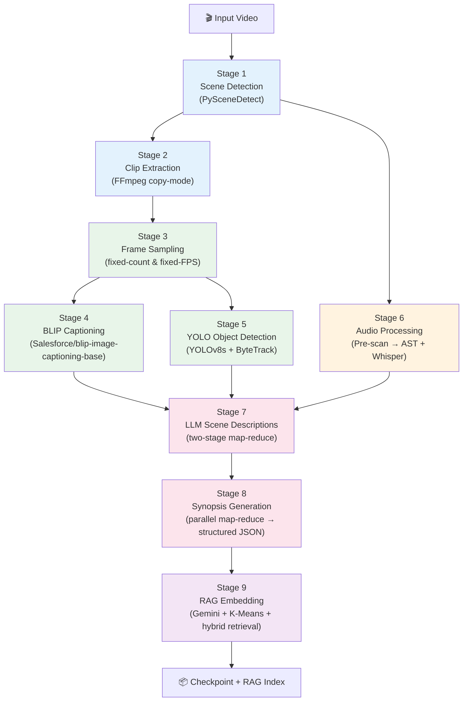

# Kairos Pipeline — Detailed Walkthrough

> **Audience:** developers, contributors, reviewers.
> This document traces every byte of data from the raw video file to the
> final RAG-ready embedding, covering each of the pipeline's stages in
> implementation-level detail.

---

## 1  Pipeline Overview



**Entrypoint:** `run_pipeline()` in `src/kairos/core/pipeline.py`.
Each stage is wrapped by the `@log_step()` decorator (via the `_logged()` shim),
which captures wall time, CPU time, RAM, GPU, and IO deltas.
A JSON checkpoint is saved after every stage so the pipeline can resume
from the last completed stage on restart.

---

## 2  Stage 1 — Scene Detection

| Item | Detail |
|---|---|
| **Module** | `src/kairos/video/scene_detection.py` |
| **Function** | `get_scene_list()` |
| **Detector** | `scenedetect.detectors.ContentDetector` |
| **Config keys** | `pyscene_threshold` (default `27.0`), `pyscene_shortest` (default `2.0` s) |

### Algorithm

1. **Read video metadata** — open with OpenCV to get FPS and frame count.
   If FPS is missing or ≤ 0, default to `30.0`.
2. **Compute `min_scene_len`** — `max(1, round(fps × min_scene_sec))` frames.
3. **First pass** — run `ContentDetector(threshold=threshold, min_scene_len=...)` with
   `frame_skip=3`.
4. **Retry on empty** — if no scenes are found, retry with
   `threshold × retry_threshold_factor` (default `0.5`, i.e. half the original threshold,
   floored at `0.1`).
5. **Fixed-duration fallback** — if still empty, split the video into segments of
   `fallback_interval_sec` seconds (default `20`).

### Output

A `list[dict]` — one dict per scene:

```python
{
    "scene_index": 0,
    "start_timecode": "00:00:00.000",
    "end_timecode": "00:00:12.345",
    "start_seconds": 0.0,
    "end_seconds": 12.345,
    "duration_seconds": 12.345,
}
```

After detection, the scene list is pretty-printed via `see_scenes_cuts()`.

---

## 3  Stage 2 — Clip Extraction

| Item | Detail |
|---|---|
| **Module** | `src/kairos/core/checkpoint.py` |
| **Function** | `save_clips()` |
| **Tool** | FFmpeg (via `imageio_ffmpeg.get_ffmpeg_exe()`) |

### Algorithm

For each scene in the list:

1. **Build FFmpeg command:**
   ```
   ffmpeg -y -i <video> -ss <start> -t <duration> -c copy <output>.mp4
   ```
   The `-c copy` flag means **no re-encoding** — the clip is extracted in
   copy mode for speed.
2. **Skip existing** — if the clip file already exists on disk, reuse it.
3. **Add `clip_path`** — each scene dict is augmented with a `"clip_path"` key
   pointing to the extracted `.mp4` file.

Clips are saved to `<output_dir>/.clips/scene_NNNN.mp4`.

---

## 4  Stage 3 — Frame Sampling

| Item | Detail |
|---|---|
| **Module** | `src/kairos/video/frame_sampling.py` |
| **Functions** | `sample_frames()` (fixed count), `sample_fps()` (fixed FPS) |
| **Config keys** | `frames_per_scene` (default `3`), `yolo_action_fps` (default `4.0`), `frame_resolution` (default `320`) |

### Two sampling modes

| Mode | Used by | Strategy |
|---|---|---|
| **Fixed count** (`sample_frames`) | BLIP captioning | Evenly distributes `num_frames` positions across `[start, end]` with equal spacing via `gap = range / (num_frames + 1)`. |
| **Fixed FPS** (`sample_fps`) | YOLO detection | Generates frame positions at `np.arange(start_sec, end_sec, 1/fps)` and converts to frame indices via `round(t × video_fps)`. |

### Resizing

Every frame is resized by `resize_frame()`:
- Compute `scale = new_size / max(w, h)`.
- Resize with `cv2.INTER_AREA` to `(int(w*scale), int(h*scale))`.
- **Aspect ratio is preserved**; the longest side matches `frame_resolution`.

### Saving to disk

`_save_scene_frames()` writes frames as JPEG to
`<output_dir>/scene_NNN/frame_NN.jpg`, returning a list of paths.

### Keys added to scene dicts

| Key | Source |
|---|---|
| `frames` | Fixed-count sampling (numpy arrays) |
| `frame_paths` | File paths for the above |
| `yolo_frames` | Fixed-FPS sampling for YOLO |
| `yolo_frame_paths` | File paths for the above |
| `frame_indices`, `frame_timestamps`, `sample_fps` | Optional metadata (when `store_meta=True`) |

---

## 5  Stage 4 — BLIP Captioning

| Item | Detail |
|---|---|
| **Module** | `src/kairos/video/frame_captioning.py` |
| **Model** | `Salesforce/blip-image-captioning-base` |
| **Class** | `BlipForConditionalGeneration` + `BlipProcessor` |

### Lazy loading

The model and processor are loaded once on first use and cached in module-level
globals (`_blip_model`, `_blip_processor`).  The `ModelRegistry` singleton
(`src/kairos/core/models.py`) provides an alternative thread-safe accessor
with per-model locking.

The model is moved to CUDA when available, otherwise CPU.

### Generation parameters

Controlled by `PipelineConfig.blip_params` and forwarded as `**kwargs` to
`model.generate()`:

| Parameter | Default | Description |
|---|---|---|
| `prompt` | `"a video frame of"` | Conditions the decoder |
| `max_length` | `50` | Maximum token count |
| `min_length` | `15` | Minimum token count |
| `num_beams` | `1` | Beam search width |
| `do_sample` | `True` | Enable nucleus sampling |
| `top_p` | `0.85` | Nucleus probability threshold |
| `temperature` | `0.65` | Sampling temperature |
| `length_penalty` | `1.0` | Beam search length penalty |
| `no_repeat_ngram_size` | `3` | Prevents repeated n-grams |
| `repetition_penalty` | `1.1` | Penalises repeated tokens |

### Per-frame flow

1. Normalise image (BGR numpy → RGB PIL).
2. Run through processor with optional text prompt.
3. Move tensors to model device.
4. `model.generate(**inputs, **kwargs)` under `torch.no_grad()`.
5. Decode token IDs with `processor.decode(skip_special_tokens=True)`.

### Output

Each scene dict gains a `"frame_captions"` key: a `list[str]` of captions,
one per sampled frame.

---

## 6  Stage 5 — YOLO Object Detection

| Item | Detail |
|---|---|
| **Module** | `src/kairos/video/object_detection.py` |
| **Model** | YOLOv8s (`models/yolov8s.pt`) via `ultralytics.YOLO` |
| **Config keys** | `yolo_model_path`, `yolo_conf_thres` (default `0.8`), `yolo_iou_thres` (default `0.5`), `yolo_action_fps` (default `4.0`) |

### Detection & tracking flow

1. **ByteTrack tracking** (default, `use_bytetrack=True`):
   - Call `run_yolo_track_on_frames()` which feeds all scene frames to
     `model.track(persist=True, tracker="bytetrack.yaml")`.
   - Parse results via `parse_yolo_results()` into a `dict[frame_idx, list[det]]`.

2. **Fallback** — if ByteTrack produces no results, run per-frame detection via
   `run_yolo_on_frame()`.

3. **IoU-based fallback tracker** — if detections lack `track_id` fields,
   `assign_track_ids_iou(iou_threshold=0.3)` assigns IDs by matching bounding
   boxes across consecutive frames using intersection-over-union.

### Track summaries

Built by `build_track_summaries()` in `src/kairos/video/track_summary.py`:

| Metric | Source |
|---|---|
| **Position labels** | `position_label(x, y, w, h)` — maps centre to grid labels like `"top-left"`, `"center"`, `"bottom-right"` |
| **Movement labels** | `movement_label()` — describes direction (`"moving left"`, `"moving down"`) and scale changes (`"zooming in"`, `"zooming out"`) |
| **Path metrics** | `path_metrics()` — cumulative `path_length`, `net_displacement`, heading `direction_change_var` |
| **Loop detection** | If `net_disp < 3% diagonal` and `path_length > 15% diagonal` and `angle_var > 0.2` → append `"looping/circling"` |
| **Inter-object relations** | `compute_relations()` — spatial relationships between tracked objects |

### Debug drawing

When `output_dir` is set, `debug_draw_yolo()` renders annotated frames to
`.yolo/scene_NNN/detection_NNN.jpg` with bounding boxes and labels.

### Output

Each scene dict gains a `"yolo_detections"` key containing a `list[dict]` of
track summaries (one per tracked object).

---

## 7  Stage 6 — Audio Processing

Audio runs independently from the visual pipeline.  It uses a **two-phase** approach.

### Phase A — Pre-scan

| Item | Detail |
|---|---|
| **Module** | `src/kairos/audio/prescan.py` |
| **Function** | `scan_audio()` |

#### Sub-steps

1. **Audio extraction** (`src/kairos/audio/extraction.py`):
   - Primary: **PyAV** — decode all audio frames, average channels to mono,
     resample to `target_sr` (default `16000`) via `librosa.resample`.
   - Fallback: **FFmpeg subprocess** — `ffmpeg -vn -ac 1 -ar 16000 -f f32le -`
     piped to stdout, then `np.frombuffer(dtype=float32)`.
   - Worst case: return a single-sample zero array.

2. **RMS profiling** (`src/kairos/audio/rms.py`):
   - `compute_rms_profile(audio, sr)` → global `mean_rms_dbfs`, `max_rms_dbfs`.
   - `compute_per_scene_rms(audio, sr, scenes)` → per-scene dBFS values.

3. **Dynamic thresholds** based on video duration:
   ```
   sensitivity_multiplier = min(1.0 + 0.1 × log₂(max(1, duration_min)), 1.5)
   ```
   Produces thresholds: `SILENCE_THRESHOLD_DBFS`, `SCENE_SILENCE_DBFS`,
   `VAD_THRESHOLD`, `MIN_SPEECH_DURATION_MS`, `SPEECH_PAD_MS`,
   `SPECTRAL_FLATNESS_THRESHOLD`.

4. **Global silence check** — if `max_rms_dbfs < SILENCE_THRESHOLD_DBFS`,
   skip all downstream audio.

5. **Voice Activity Detection** (`src/kairos/audio/vad.py`):
   - Uses **Silero VAD** (`snakers4/silero-vad` via `torch.hub`).
   - Returns speech regions with `start_sec` / `end_sec`.

6. **Spectral flatness** (`src/kairos/audio/spectral.py`):
   - `compute_spectral_flatness_mean(audio, sr)` — determines if non-speech
     background audio exists (flatness ≤ threshold → background audio present).

7. **Language detection** (`src/kairos/audio/language.py`):
   - `detect_languages(audio, sr, speech_regions)` → `primary_language`,
     `is_multilingual`.

8. **Speech masking** — zeroes out speech regions in a copy of the audio
   (`audio_masked`) so that downstream AST classification hears only
   background sounds.

#### Pre-scan output

A `dict` carrying: `audio`, `audio_masked`, `sr`, `duration_sec`, `has_any_audio`,
`has_speech`, `has_background_audio`, `speech_regions`, `lang_info`, `rms_profile`,
`per_scene_rms`, `spectral_flatness_mean`, `thresholds_used`, `scan_time_sec`.

---

### Phase B.1 — AST Sound Classification

| Item | Detail |
|---|---|
| **Module** | `src/kairos/audio/classifier.py` |
| **Function** | `extract_sounds_optimized()` |
| **Model** | `MIT/ast-finetuned-audioset-10-10-0.4593` (Audio Spectrogram Transformer) |

1. **Skip logic:**
   - If `has_any_audio` is `False` or `has_background_audio` is `False`,
     every scene is labelled `"none"` immediately.
   - Per-scene: if the scene's RMS is below `SCENE_SILENCE_DBFS`, skip it.

2. **Parallel execution:**
   - Uses `ProcessPoolExecutor` (or `ThreadPoolExecutor`) with up to
     `max_workers=4`.
   - Each worker calls `classify_scene_audio()` which runs the AST model
     on the scene's audio slice.
   - Detections above `threshold=0.3` sigmoid probability are returned as
     comma-separated `"label (conf=X.XX)"` strings.

3. **Output:** `"audio_natural"` key per scene.

---

### Phase B.2 — Whisper Transcription

| Item | Detail |
|---|---|
| **Module** | `src/kairos/audio/transcription.py` |
| **Function** | `extract_speech_singlecall()` |
| **Model** | OpenAI Whisper (`medium` by default) — Azure API or local |

#### Routing decision

| Condition | Method |
|---|---|
| `parallel=True` or duration > 900 s | `transcribe_parallel()` |
| Otherwise | `transcribe_full_video()` (single call) |

#### Parallel chunked transcription (`transcribe_parallel`)

1. Split audio into overlapping chunks (`chunk_size_sec=600`, `overlap_sec=30`).
2. Build worker args; each chunk is dispatched to `_transcribe_chunk_worker`.
3. **Executor:** `ThreadPoolExecutor` for API mode, `ProcessPoolExecutor` for local.
   Max workers: `4` (API) or `2` (local).
4. **Per-chunk worker:**
   - Optional noise reduction (`noisereduce`).
   - **API path:** `transcribe_via_api()` with `retry_with_backoff(max_retries=2, base_sec=30)`.
     Falls back to local model on API failure.
   - **Local path:** `whisper.load_model(size).transcribe()`, then free GPU.
   - Shift segment timestamps by `chunk_start_time`.
5. Merge all segments, sort by `start`, deduplicate.
6. **Hallucination filtering** (`src/kairos/audio/text_filter.py`):
   - Drop segments with >15% special characters.
   - Drop if `avg_logprob < -1.2` or `no_speech_prob > 0.8`.
   - Clean repetitive text and emoji.
   - Deduplicate by normalised text.

#### Single-call transcription (`transcribe_full_video`)

1. Aggressive noise reduction (`prop_decrease=0.95`).
2. Optional VAD-guided cleaning: per-speech-segment lighter noise reduction.
3. `model.transcribe(cleaned, fp16=False)`.

#### Scene mapping

`map_segments_to_scenes()` assigns Whisper segments to scenes based on
temporal overlap (≥ 20% of segment duration or ≥ 0.5 s absolute overlap).

#### Output

Each scene dict gains an `"audio_speech"` key with the concatenated
transcription text.

---

## 8  Stage 7 — LLM Scene Descriptions

| Item | Detail |
|---|---|
| **Module** | `src/kairos/llm/scene_description.py` |
| **Function** | `describe_scenes()` |
| **Config keys** | `llm_scene_history` (default `5`), `llm_cooldown_sec`, `llm_max_workers` |

### Two-stage map-reduce

#### Stage 1 — Short summaries (parallel map)

1. `raw_descriptions()` formats each scene into structured text:
   - Per-frame captions (from BLIP).
   - Track summaries (from YOLO) formatted as narrative lines.
   - Audio transcript and audio sounds appended.

2. All formatted scenes are sent to `_parallel_map()` with the
   **short prompt** (`describe_scene_short.txt`):
   - `ThreadPoolExecutor(max_workers=min(8, len(scenes)))`.
   - Each call goes through `_generate_with_fallback()`:
     primary prompt → fallback prompt → `None`.
   - Each call uses `retry_with_backoff()` for rate-limit errors
     (up to `max_rate_limit_retries=4`, `rate_limit_cooldown_sec=20`).
   - A fixed `post_cooldown_sec` sleep follows every call.

#### Stage 2 — Full descriptions (parallel map with context)

1. For each scene `i`, build input =
   `raw_formatted_text + _build_short_context(short_summaries, i, hist_size)`.
   The context window includes up to `hist_size` (default 5) preceding short
   summaries, giving the LLM temporal awareness.

2. Send through `_parallel_map()` again, this time with the **full prompt**
   (`describe_scene.txt`) and its fallback (`fallback_describe_scene.txt`).

### Prompt templates

| Template | Purpose |
|---|---|
| `describe_scene_short.txt` | Stage 1 — produce a brief summary |
| `describe_scene.txt` | Stage 2 — produce a full description with scene context |
| `fallback_describe_scene.txt` | Used when the primary prompt fails |

Each template has `{{SCENE_TEXT}}` and `{{VIDEO_NAME}}` placeholders filled
at call time.  The scene text is normalised via `apply_gpt_normalization()`.

### Output

Each scene dict gains an `"llm_scene_description"` key with the full
natural-language description.

---

## 9  Stage 8 — Synopsis Generation

| Item | Detail |
|---|---|
| **Module** | `src/kairos/llm/synopsis/synthesis.py`, `mapreduce.py`, `parsing.py`, `prompts.py`, `render.py` |
| **Functions** | `summarize_scenes()`, `synthesize_synopsis()` |

### Step 1 — Narrative summarisation (`summarize_scenes`)

A parallel **map-reduce** pipeline condenses all scene descriptions into a
single narrative:

1. **Chunking** (`chunk_scenes()`):
   - Each scene's `llm_scene_description` and `audio_speech` are converted to a
     one-line narrative via `_scene_to_narrative_line()`.
   - Lines are accumulated until `chunk_size` (default `7000`) chars, then a new
     chunk starts.

2. **Parallel map** (`parallel_map_summaries()`):
   - Up to `SUMMARY_MAX_WORKERS=6` threads.
   - Each chunk is summarised by the LLM via `_build_scene_chunk_summary_prompt()`.
   - On failure, the raw chunk text is kept.

3. **Parallel reduce** (`parallel_reduce_summaries()`):
   - Groups of `SUMMARY_REDUCE_GROUP_SIZE=4` adjacent summaries are merged per round.
   - Rounds repeat until a single summary remains.

4. **Consistency pass** — if the narrative still exceeds `summary_len`, a final
   LLM call rewrites it for consistency and length.

5. **Narrative snapshots** — each successive version is stored in
   `checkpoint["narratives"]` with `narrative_len` and `chunk_len` metadata.

### Step 2 — Structured synopsis (`synthesize_synopsis`)

Produces a JSON object with: `chat_name`, `summary`, `video_highlights`,
`video_timeline`, `questions`.

#### Parallel section calls

Six prompts are fired **in parallel** via `ThreadPoolExecutor(max_workers=8)`:

| Section | Prompt template | Output |
|---|---|---|
| `summary` | `synopsis_summary.txt` | `chat_name` + `summary` |
| `highlights` | `synopsis_highlight.txt` | `video_highlights` (4–6 timestamped entries) |
| `timeline` | `synopsis_timeline.txt` | `video_timeline` (4–6 events) |
| `qna_predefined_a` | `synopsis_qna_predefined.txt` | First half of 22 required Q&As |
| `qna_predefined_b` | `synopsis_qna_predefined.txt` | Second half of 22 required Q&As |
| `qna_generated` | `synopsis_qna_generated.txt` | 15 additional generated Q&As |

Each call uses `call_gpt()` with up to `GPT_MAX_RETRIES=6` and
exponential backoff (`GPT_RETRY_BASE_SEC=2.0`).  Content-filter errors
are **not** retried.  On total failure, a safe prompt and then a hard-coded
fallback string are used.

#### Parsing & validation

Raw LLM text is parsed by a two-tier strategy:
1. Non-JSON parser (regex/heuristic) → `_parse_summary_nonjson()`, etc.
2. JSON extraction fallback → `_parse_json_object()`.
3. Validation via `_validate_*_payload()` functions.

#### Repair loop

Failed sections are re-called via `_build_repair_prompt()` with
`ThreadPoolExecutor(max_workers=6)`.

#### Monolith fallback

If `summary`, `highlights`, or `timeline` all fail parsing,
`_apply_monolith_fallback()` fires a single combined prompt to produce
all three at once.

#### Question filling

If generated questions are fewer than `extra_questions_count=15`:
1. `_fill_missing_generated()` asks the LLM for more.
2. Remaining gaps are padded with placeholder entries.

If total questions (22 predefined + 15 generated = 37) are still short,
a **legacy questions fallback** prompt is tried.

#### 22 required questions

```
1.  What is happening in the video?
2.  What are the key events?
3.  What are the key actions and who performed them?
4.  What are the main conflicts and problems encountered?
5.  Who is the main character? Describe their journey.
6.  List the characters...
7.  What are some significant quotes...
8.  What is the setting?...
9.  How did the video start?...
10. How did the video end?...
11. What objects are central to the video...
12. What is the most important thing said or heard?
13. What is different at the end vs the beginning?
14. What type of video is this?
15. What is the goal or intent or theme of the video?
16. List the moods and tones present...
17. What context is missing or assumed?...
18. What are key visual descriptions?
19. What are key audio descriptions?
20. Are the visual and audio cues aligned?...
21. What are prominent visual cues and audio cues...
22. Does the video contain any live action, animation, or special effects?
```

#### Optional consistency pass

Controlled by `consistency_pass_mode`:
- `"off"` — skip (default).
- `"on_error"` — run only when parsing errors occurred.
- `"always"` — always run.

The pass re-validates the full synopsis against the source narrative.

#### Markdown rendering

`render_synopsis_markdown()` produces a human-readable `.md` file saved to
`<output_dir>/synopsis.md`.

#### Output

`checkpoint["synopsis"]` — a structured JSON dict:
```json
{
    "chat_name": "...",
    "summary": "...",
    "video_highlights": [{"timestamp": "...", "highlight": "..."}, ...],
    "video_timeline": [{"timestamp": "...", "event": "..."}, ...],
    "questions": [{"question": "...", "answer": "..."}, ...]
}
```

---

## 10  Stage 9 — RAG Embedding

| Item | Detail |
|---|---|
| **Module** | `src/kairos/llm/rag.py` |
| **Function** | `make_embedding()` |
| **Embedding model** | Gemini `gemini-embedding-001` (configurable via `GEMINI_EMBEDDING_MODEL` env var) |

### Context building

`build_contexts()` merges two sources:

1. **Scene-level contexts** (`format_scene_embedding()`):
   Each scene → one sentence:
   ```
   From HH:MM:SS to HH:MM:SS, <llm_description>.
   Visible objects include <yolo_labels>.
   Background audio: <audio_natural>.
   Spoken dialogue: <audio_speech>.
   ```

2. **Synopsis-level contexts** (`format_synopsis_embedding()`):
   - `summary: ...`
   - `video_highlights: h1 | h2 | ...`
   - `video_timeline: e1 | e2 | ...`
   - `questions: Q: ... A: ... | ...`

### Embedding

`embed_contexts()` sends contexts in batches of `MAX_EMBED_BATCH=250` to
the Gemini embedding endpoint via `client.models.embed_content()`.

### K-Means clustering

1. **Optimal k** — `find_optimal_k_elbow()`:
   - Tests k = 2 … min(n/2, 20).
   - Computes inertia for each k.
   - Picks k that maximises the **second-order difference** (acceleration)
     of the inertia curve.
2. **Fit** — `KMeans(n_clusters=k, n_init=10)` from scikit-learn.
3. Stores `cluster_assignments` and `centroids`.

### Hybrid retrieval (`merge_retrieval`)

At query time:

1. **Base similarity** — dot product between query vector and each scene embedding.
2. **Cluster boost** — find the `top_c=3` closest cluster centroids to the query;
   boost members of those clusters by `alpha=0.3` (normalised).
3. **Final score** = `base_similarity + cluster_boost`.
4. Return top-k results sorted by descending score.

### Persistence

`save_rag_embeddings()` writes to `<output_dir>/rag_embedding.json`:
```json
{
    "model": "gemini-embedding-001",
    "context_count": N,
    "embedding_dim": D,
    "contexts": ["..."],
    "embeddings": [[...], ...],
    "kmeans_clusters": {
        "algorithm": "kmeans",
        "num_clusters": K,
        "cluster_assignments": [...],
        "centroids": [[...], ...]
    }
}
```

---

## 11  Checkpointing

| Item | Detail |
|---|---|
| **Module** | `src/kairos/core/checkpoint.py` |
| **Functions** | `save_checkpoint()`, `read_json()`, `have_key()`, `clear_frames()` |

### How it works

1. After every pipeline stage completes, `save_checkpoint()` is called.
2. **Frame stripping** — `clear_frames()` removes heavy keys before JSON
   serialisation:
   ```
   frames, yolo_frames, frame_paths, yolo_frame_paths,
   frame_indices, frame_timestamps, sample_fps,
   motion_bullets, yolo_tracks, yolo_track_summaries
   ```
3. The checkpoint is written to `<output_dir>/checkpoint.json`.
4. On pipeline restart, `read_json()` loads the checkpoint.
5. Each `_run_*` helper checks for the presence of its output key
   (via `have_key()`) and **skips** the stage if data already exists.

### Redo mechanism

`apply_redo()` (`src/kairos/core/redo.py`) selectively clears checkpoint
keys for specific stages, allowing re-execution without restarting the
entire pipeline.  When `redo_only=False`, downstream dependents are also
cleared automatically.

---

## 12  Logging

| Item | Detail |
|---|---|
| **Module** | `src/kairos/core/logging.py` |
| **Functions** | `initiate_log()`, `complete_log()`, `save_log()`, `log_step()`, `get_system_context()`, `get_gpu_stats()` |

### Per-step metrics (`log_step()` decorator)

Every pipeline function wrapped by `_logged()` returns a `(result, log_entry)` tuple.
The `log_entry` dict captures:

| Metric | Description |
|---|---|
| `wall_time_sec` | Elapsed real time |
| `cpu_time_sec` | CPU process time delta |
| `ram_before_MB` / `ram_after_MB` / `ram_used_MB` | RSS memory snapshots |
| `io_read_MB` / `io_write_MB` | Cumulative I/O delta (via `psutil`) |
| `gpu_before` / `gpu_after` | Per-GPU stats (utilisation %, VRAM) |
| `cuda_before_MB` / `cuda_after_MB` / `cuda_peak_MB` | PyTorch CUDA memory |

### GPU stats collection

Three-tier fallback:
1. **NVML** (`pynvml`) — most detailed (GPU util %, memory util %).
2. **PyTorch CUDA** — memory figures only.
3. **Empty list** — no GPU information.

### System context (`get_system_context()`)

Captured at pipeline start and end:
- OS info (name, version, architecture, hostname, Python version).
- CPU info (model, physical/logical cores, frequency).
- RAM info (total, available, used, usage %).
- Disk info (total, used, free, usage %).
- GPU info (model, VRAM, driver version via `nvidia-smi`).

### Log persistence

`save_log()` writes to `logs/runs/<output_dir>_YYYYMMDD_HHMMSS.json`
with the complete `log` dict including all step metrics and system context.
