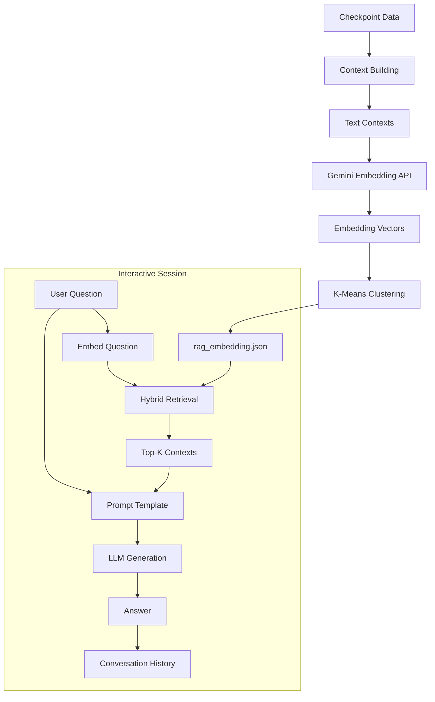

# RAG System Documentation

## Overview

Kairos implements a Retrieval-Augmented Generation (RAG) system that enables natural-language question answering over processed videos. Rather than relying solely on the LLM's parametric knowledge, the system retrieves relevant context from the video's scene descriptions and synopsis, then feeds that context to the LLM to produce grounded answers.

The RAG pipeline runs as the final stage of video processing (`make_embedding`) and produces a `rag_embedding.json` file that powers the interactive `kairos rag` chatbot.

---

## Pipeline Diagram



---

## Context Building

The `build_contexts()` function extracts embeddable text chunks from a pipeline checkpoint. Two types of content are processed:

### Scene Contexts (`format_scene_embedding`)

Each scene in the checkpoint is converted to a single natural-language sentence:

```
From {start_timecode} to {end_timecode}, {llm_scene_description}.
Visible objects include {yolo_objects}.
Background audio: {audio_natural}.
Spoken dialogue: {audio_speech}.
```

This combines all modalities (visual description, object detection, audio classification, speech transcription) into a unified text representation per scene.

### Synopsis Contexts (`format_synopsis_embedding`)

When the checkpoint contains a synopsis dictionary, these fields are extracted as separate context chunks:

| Synopsis Field | Format |
|----------------|--------|
| `summary` | `"summary: {text}"` |
| `video_highlights` | `"video_highlights: highlight1 \| highlight2 \| …"` |
| `video_timeline` | `"video_timeline: timestamp - event1 \| timestamp - event2 \| …"` |
| `suggested_clips` | `"suggested_clips: description1 \| description2 \| …"` |
| `questions` | `"questions: Q: question1 A: answer1 \| Q: question2 A: answer2 \| …"` |

If the synopsis is a plain string rather than a dictionary, it is split by double newlines into paragraph-level chunks.

---

## Embedding

### Model

Contexts are embedded using the **Gemini Embedding API** (`gemini-embedding-001` by default, configurable via the `GEMINI_EMBEDDING_MODEL` environment variable).

### Batch Processing

The `embed_contexts()` function sends texts to the API in batches of up to **250** items (`MAX_EMBED_BATCH`), accumulating the resulting vectors:

```python
for start in range(0, len(contexts), batch_size):
    result = client.models.embed_content(
        model=model, contents=contexts[start : start + batch_size]
    )
    embeddings.extend([e.values for e in result.embeddings])
```

### Question Embedding

User questions are embedded individually using the same model and client via `embed_question()`:

```python
result = client.models.embed_content(model=model, contents=question)
return result.embeddings
```

---

## Clustering

### K-Means with Elbow Method

After embedding all contexts, K-Means clustering groups semantically similar contexts together. The optimal number of clusters is determined automatically using the **elbow method**.

#### `find_optimal_k_elbow()`

1. Tests k = 2 through min(n//2, 20) where n is the number of embeddings.
2. Computes K-Means inertia for each k value.
3. Calculates the second-order difference (acceleration) of the inertia curve.
4. Selects the k with the maximum acceleration as the "elbow" point.
5. Returns at least k=2.

#### `compute_kmeans_clusters()`

Runs K-Means with the optimal k (or a caller-specified value) and returns:

```json
{
    "algorithm": "kmeans",
    "num_clusters": 5,
    "cluster_assignments": [0, 2, 1, 0, 3, ...],
    "centroids": [[0.12, -0.34, ...], ...]
}
```

Both `cluster_assignments` and `centroids` are persisted in `rag_embedding.json` to avoid recomputation during interactive sessions.

---

## Retrieval

### Hybrid Approach: Cosine Similarity + Cluster Boost

The retrieval system (`merge_retrieval()`) uses a two-signal hybrid scoring mechanism:

#### 1. Base Similarity (Cosine / Dot Product)

```
base_sims = scene_embedding_matrix @ query_vector
```

Each context's embedding is compared to the query embedding via dot product (equivalent to cosine similarity when vectors are normalized).

#### 2. Cluster Boost

The cluster boost adds a secondary signal based on cluster-level relevance:

1. Compute similarity between the query vector and each cluster centroid.
2. Select the **top-c** (default: 3) most similar cluster centroids.
3. For each context belonging to a top cluster, assign a boost proportional to the centroid-query similarity.
4. Normalize the boost values to [0, 1] and scale by **alpha** (default: 0.3).

#### Final Score

```
final_score = base_similarity + cluster_boost
```

The **alpha** parameter (default: 0.3) controls the weight of the cluster boost relative to the base similarity. This means the cluster signal contributes at most 30% additional weight.

#### Top-K Selection

Results are sorted by `final_score` in descending order and the top-**k** (default: 10, configurable via `rag_top_k_context` in `PipelineConfig`) are returned as `(context_text, score)` tuples.

### Parameters

| Parameter | Default | Description |
|-----------|---------|-------------|
| `k` | 10 | Number of top contexts to retrieve |
| `top_c` | 3 | Number of closest cluster centroids for boosting |
| `alpha` | 0.3 | Weight of cluster boost (0 = pure cosine, 1 = heavy cluster influence) |

---

## Answer Generation

### Prompt Template

The `generate_answer.txt` template structures the LLM prompt:

```
You are answering questions about a video using scene descriptions and metadata.

Use the provided video content to answer the question.
Prioritize information that clearly appears in the descriptions or metadata.

If relevant scenes appear consecutively, group their timestamps and treat
them as one cohesive scene where appropriate while formulating your answer.

Ensure both start and end timestamps are included for every relevant moment
you state in your response.

If the question refers to something not explicitly stated but may be implied,
you may suggest the closest relevant scenes that could match the request.

If you cannot confidently identify the exact moment:
* Do not invent details.
* Briefly explain that the exact moment could not be confirmed.
* Provide similar or potentially relevant moments from the retrieved scenes.

If nothing relevant appears in the provided content, say:
"This information is not available in the video content."

Video content:
{context}

Question:
{question}
```

### LLM Call

The `create_answer()` function:

1. Concatenates all top-K context texts with newlines.
2. Fills the prompt template with the context and question.
3. Calls the LLM client's `generate()` method (or falls back to a raw Gemini client).
4. Returns the generated answer text.

The generation model defaults to `gemini-2.5-pro` (configurable via `GEMINI_RAG_MODEL` env var). When a pre-built `LLMClient` is passed (e.g., via `--llm openai`), that client is used instead.

---

## Interactive Session

### `ask_rag()` Function

The interactive RAG loop (`kairos.cli.rag_session`) manages:

1. **Loading** — reads `rag_embedding.json` containing contexts, embeddings, and K-Means clusters.
2. **Question loop** — prompts for user questions, embeds each question, retrieves top-K contexts, generates an answer, and displays results.
3. **Optional features:**
   - `show_k_context=True` — display the retrieved context snippets and their similarity scores.
   - `show_timings=True` — display per-stage timing (embed, search, generation).
4. **Conversation history** — each Q&A exchange is appended to a JSON file (`conversation_history.json`) with timestamps, scores, and timing data.

### Conversation Entry Format

```json
{
    "timeDate": "2024-06-15 14:30:22",
    "user": "What happens at the end of the video?",
    "rag_answer": "The video concludes with...",
    "top_k_similar": [
        [0.8234, "From 01:45:00 to 01:47:30, the final scene shows..."],
        [0.7891, "summary: The video ends with a dramatic conclusion..."]
    ],
    "durations": {
        "question_embedding": 0.3421,
        "context_search": 0.0012,
        "llm_generation": 2.1543
    },
    "source": "data/processed/Video.mkv/checkpoint.json"
}
```

---

## Persistence

### `rag_embedding.json` Structure

```json
{
    "model": "gemini-embedding-001",
    "context_count": 47,
    "embedding_dim": 3072,
    "contexts": [
        "From 00:00:01 to 00:00:15, a boy stands outside a school...",
        "summary: A coming-of-age story about..."
    ],
    "embeddings": [
        [0.012, -0.034, 0.056, ...],
        [0.023, -0.011, 0.089, ...]
    ],
    "kmeans_clusters": {
        "algorithm": "kmeans",
        "num_clusters": 5,
        "cluster_assignments": [0, 2, 1, ...],
        "centroids": [[0.01, -0.02, ...], ...]
    }
}
```

### Key Design Decisions

- **Pre-computed clusters** — K-Means is run once at embedding time and persisted, avoiding recomputation on every query.
- **Unified context format** — scene data and synopsis data are mixed into a single context list, allowing retrieval to surface both granular scene details and high-level video summaries.
- **Modality fusion** — each scene context combines visual (BLIP + YOLO), audio (AST), and speech (Whisper) signals into a single text representation, enabling cross-modal queries.
