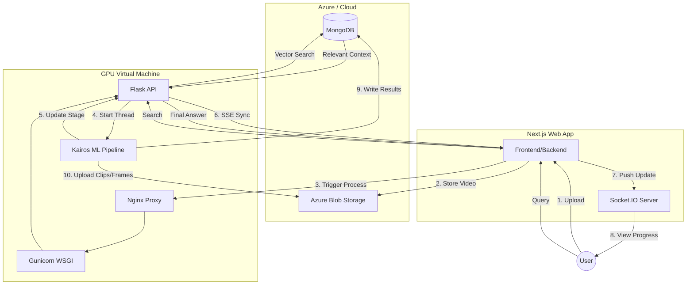

# Kairos MongoDB & VM Migration Plan

This document outlines the architectural and implementation strategy for migrating the Kairos video processing pipeline to a GPU-accelerated Virtual Machine (VM) and integrating it with a MongoDB-backed storage system.

---

## 1. System Architecture (Optimized)

The Kairos system utilizes a distributed architecture to handle compute-heavy ML tasks while maintaining a responsive user interface.

### Server Stack on VM
- **Nginx**: Acts as the front door. Handles HTTPS (TLS) encryption, reverse proxies traffic to Gunicorn, and manages large file uploads (up to 5GB).
- **Gunicorn (Green Unicorn)**: A robust WSGI HTTP Server. It manages multiple Flask worker processes, ensuring stability and reliability.
- **Flask**: Chosen for its simplicity and synchronous nature, which perfectly matches our GPU-bound workload (processing one video at a time).

> [!NOTE]
> **Why Flask over FastAPI?** While FastAPI is excellent for async-heavy network tasks, our bottleneck is the GPU. Flask provides a simpler, more stable environment for synchronous pipeline execution without the overhead of async event loops.

---

## 2. Integrated System Diagram

The following diagram illustrates the end-to-end flow from user upload to real-time progress tracking and final storage.

---

## 3. Real-Time Progress: Server-Sent Events (SSE)

Instead of traditional "polling" (where the app repeatedly asks the VM for status), we implement **SSE**.

1. **Connection**: The Next.js app opens a persistent connection to `GET /jobs/<runId>/stream`.
2. **Push**: The Flask app uses a Python generator to `yield` progress messages as text streams.
3. **Efficiency**: This reduces network overhead and ensures that the user sees "Frame Captioning" or "Audio Analysis" exactly when it happens.

---

## 4. Database Schema (v3 Optimized MVP)

We utilize three primary collections to minimize round-trips and optimize for read-heavy workloads.

### 1. `users`
Identity, authentication, and user preferences.

### 2. `chats`
The core work unit. Each document is self-contained.
- **Video Metadata**: Blob paths, duration, size.
- **Pipeline State**: Current stage (`processing`, `ready`, `failed`), `currentJobId`, and a bounded history of the last 5 attempts.
- **Messages**: Embedded array of conversation history to enable single-document reads.

### 3. `chat_chunks`
Searchable retrieval units, kept separate for **Atlas Vector Search**.
- **Embeddings**: 1536-dim (or similar) vectors for semantic search.
- **Context**: A single merged text block combining captions, speech (ASR), and LLM scene descriptions.

---

## 5. Security & Deployment

- **Authentication**: A shared `KAIROS_VM_API_KEY` must be present in the `X-API-Key` header of every request.
- **Encryption**: Nginx handles SSL termination. Port 8000 is blocked by the firewall; only port 443 (Nginx) is exposed.
- **Process Management**: `systemd` manages the Flask/Gunicorn service, ensuring it restarts automatically on failure or VM reboot.

---

## 6. Implementation Checklist

### Phase 1: Storage Layer
- [x] Implement `StorageManager` in `src/storage_utils.py`. (Completed: Support for Auto-Sync & Deterministic IDs)
- [x] Add MongoDB connection logic using `pymongo`. (Completed: Connected to Atlas Cluster)
- [x] Refactor `main.py` to use `StorageManager` for all checkpointing. (Completed: Integrated into processing loop)

### Phase 2: Pipeline Reporting
- [x] Update `main.py` status logging to be captured by the Flask orchestrator. (Completed: Integrated with StorageManager)
- [x] Implement `--chat-id` argument pass-through. (Completed: Added optional auto-generation for raw runs)

### Phase 3: Flask & SSE
- [x] Create `server/app.py` with Flask and Gunicorn configuration. (Completed: API Ready)
- [x] Implement the SSE `/stream` endpoint. (Completed: Real-time progress bar support)
- [ ] Configure Nginx for `proxy_buffering off` to support real-time streaming. (Not Implemented: Nginx not present on current VM. Documentation provided in Overview report.)

---

*This document supersedes all previous architectural drafts (including KAIROS_VM_MIGRATION_PLAN.md).*
